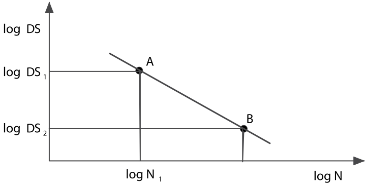
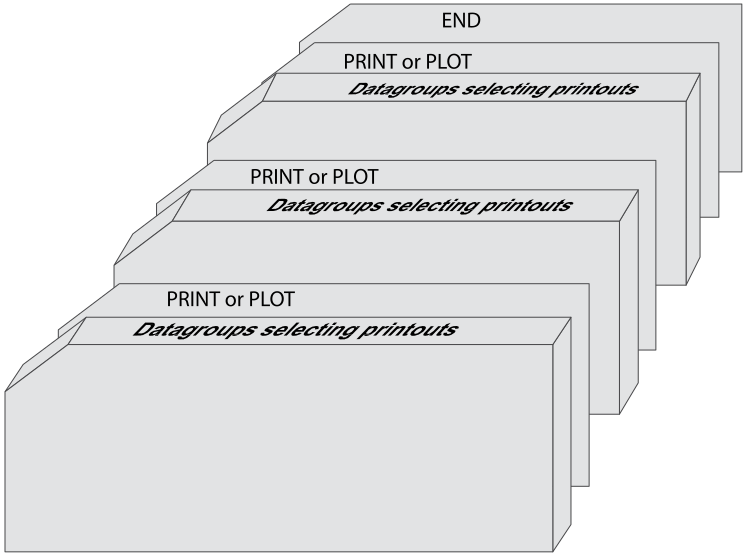
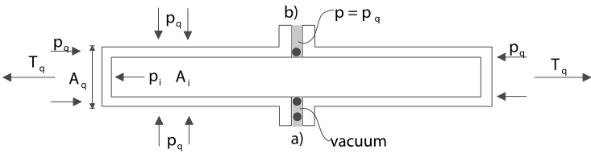

== Input to OUTMOD
.

[[outmod_general_information]]
=== General Information
.

The post-processing module `OUTMOD` has two main purposes:
.

* Generate result printout from the `INPMOD`, `STAMOD` and `DYNMOD`
modules.
* Prepare a plot file (`IFNPLO`) for later use by the plot module
(`PLOMOD`). Note that this functionality is deprecated.
.

Locations for result presentation are identified by the line identifier
and segment and element numbers specified as input to `INPMOD` for all
single riser systems (i.e. SA, SB, SC, SD and AR systems).
.

The user chooses the amount of printout by giving the appropriate
options as input data to `OUTMOD`. As for the other modules, input data
to `OUTMOD` are organised in groups. Some groups consist of the data
group identifier only, whilst other groups have additional input lines.
The first part of the input data is data groups selecting data to be
printed. Then a command must be given to start the printing. Then a new
set of data groups selecting data may be given etc, see the figure
below.
.

.Organization of OUTMOD input

.

[[outmod_a]]
=== Data Group A: OUTMOD Identification and Control Data
.

[[outmod_a_text]]
==== OUTMOD identification text
.

If you want an identification text to be printed on the front page of
the `OUTMOD` printout, the following data group may be given as the
first data group:
.

[[outmod_a_text_data]]
===== Data group identifier, one input line
.

....
OUTMod IDENTIFICATION TEXT CHVERS
....
.

* `CHVERS: character(8)`: `RIFLEX` output file version, e.g. 3.2
.

[[outmod_a_text_identification]]
===== Identification text, three input lines
.

....
Identification text, line no 1
Identification text, line no 2
Identification text, line no 3
....
.

If the data group is given, all three lines must be given, but they may
be blank.
.

[[outmod_a_print]]
==== The PRINT command
.

When `OUTMOD` is used for print generation, the following data group
identifier must be given subsequent to the specifications:
.

....
PRINT
....
.

After printing, all specifications will be deleted. Subsequent to the
print command, a new sequence of specifications and a new print command
may be given. This is useful if you want to repeat one or more
specifications with different parameters.
.

[[outmod_a_plot]]
==== Plot generation
.

*This functionality is deprecated!*
.

If you want to have plots from `STAMOD` or `DYNMOD`, you have to run
`OUTMOD` first to produce the plot file, `IFNPLO`, which is the only
file the plot module `PLOMOD` reads when plotting from the above
mentioned modules.
.

It is not possible to generate plots of all data groups. This is marked
by the word `Plot` or `NoPlot` in the right part of the data group
identifier frame:
.

....
WFMOtion TIME SERies        Plot
....
.

can be plotted, while the following can not:
.

....
INFIrr CONTRol INFOrmation      NoPlot
....
.

When you want to use `OUTMOD` to build up file `IFNPLO`, the data group
identifiers and print options are exactly the same as when you use
`OUTMOD` for normal printout, except for the following:
.

* `IFNPLO` must be initialized by one of the data group identifiers
described in `Initialization of the plot file IFNPLO' (below).
* Instead of the `PRINT` command, the `PLOT` command must be given (see
link:@ref%20outmod_a_plot_command[The PLOT command]). The `OUTMOD` print
file will contain the same information as if the `PRINT` command was
given, i.e. the `PLOT` command may be considered as an extension to the
`PRINT` command.
.

Normally, one specification gives one plot which may consist of up to
three graphs. In some cases, e.g. when one specification gives results
for six degrees of freedoms, two plots are produced per specification.
.

[[outmod_a_plot_initialization]]
===== Initialization of the plot file IFNPLO
.

When `OUTMOD` is to be used for plot generation, one of the following
initialization commands must be given after specification of `OUTMOD`
identification text (if given), but before any specification described
in Sections link:@ref%20outmod_b[Data Group B: Output from STAMOD], or
link:@ref%20outmod_c[Data Group C: Output from DYNMOD]:
.

....
NEW PLOT FILE
....
.

or
.

....
APPEnd PLOT FILE
....
.

If the command `NEW PLOT FILE` is given, `OUTMOD` writes the plot arrays
from the beginning of the file, i.e. the previous contents of the file,
if any, are overwritten. It is, however, possible to append new plots
after already existing plots on file `IFNPLO`. This is achieved by
giving the command `APPEND PLOT FILE`. A check is carried out to ensure
that the file already contains plots.
.

A maximum of 100 plots may be stored in one `IFNPLO` file.
.

If more than one initialization command is given throughout an `OUTMOD`
run, they are simply ignored.
.

[[outmod_a_plot_command]]
===== The PLOT command
.

When `OUTMOD` is used for plot generation, the following command is
given instead of the `PRINT` command (see link:@ref%20outmod_a_print[The
PRINT command]):
.

....
PLOT
....
.

If a plot command is given for a data group that cannot be plotted, a
warning message is issued on `OUTMOD` print file and execution continues
with the next data group specified.
.

There may be more than one `PLOT` within one run of `OUTMOD`, following
the same rules as for the `PRINT` command. `PRINT` and `PLOT` commands
may be mixed within one run.
.

If the `PLOT` command is given, and neither `NEW PLOT FILE` nor
`APPEND PLOT FILE` has been given, the program will terminate with an
error message.
.

[[outmod_a_communication]]
==== Communication with the STARTIMES programs
.

The following command has been included for communication with the
`STARTIMES` programs for statistical analysis of time series
.

....
STARtimes FILE      NoPlot
....
.

This command specifies that time series of a selected response quantity
shall be written to a file in `STARTIMES` format (i.e. to a file
readable by the `STARTIMES` programs). The `STARTIMES FILE` command can
be used in connection with the following data group identifiers:
.

* `WAVE ELEVATION`
* `WFMOTION TIME SERIES`
* `LFMOTION TIME SERIES`
* `TOMOTION TIME SERIES`
* `DYNDISP TIME SERIES`
* `TOTDISP TIME SERIES`
* `DYNFORC TIME SERIES`
* `DYNCURV TIME SERIES`
* `SUPPF TIME SERIES`
* `ELMANGLE TIME SERIES`
* `TOTFORC TIME SERIES`
* `DISTANCE TIME SERIES`
* `CALCURV TIME SERIES`
* `STRESS TIME SERIES`
* `STROKE TIME SERIES`
.

A response quantity is written to the `STARTIMES` file by giving
`STARTIMES FILE` immediately before the `PRINT` or `PLOT` command.
.

The name of the `STARTIMES` file is `<prefix>_outmod.ts`, and it is
stored in the current working directory. A description of this file is
found in link:@ref%20outmod_startimes[Description of STARTIMES file].
.

[[outmod_a_end]]
==== The END command
.

To terminate the input data, the following data group identifier is
given as the last input line on the `OUTMOD` input file.
.

....
END
....
.

The END data group is mandatory
.

[[outmod_b]]
=== Data Group B: Output from STAMOD
.

Description of result presentation from static analyses is given in the
following.
.

[[outmod_b_results]]
==== Results from static fixed parameter analysis
.

Displacement and force data from static fixed parameter analysis are
established by the `STAMOD` module and stored on file `IFNSTA`.
.

Specifying this output after a parameter variation run will produce the
results of the last parameter variation step.
.

[[outmod_b_results_static]]
===== Static dimension information
.

If you want dimension parameters, such as no of load steps, no of nodes
etc, to be printed, give
.

....
STATic DIMENsion PARAmeters         NoPlot
....
.

[[outmod_b_results_system]]
===== System information
.

If you want information about the connection between the local line,
segment and element number given as input to `INPMOD` and the global
`FEM` element/nodal numbers generated by `STAMOD`, give
.

....
STATic SYSTem INFOrmation       NoPlot
....
.

A more detailed description is given on the `STAMOD` print file.
.

[[outmod_b_results_coordinates]]
===== Coordinates of final static configuration
.

[[outmod_b_results_coordinates_data]]
====== Data group identifier, one input line
.

....
STATic COORdinates      Plot
....
.

[[outmod_b_results_coordinates_print]]
====== Print options, one input line
.

....
ICONF LINE-ID IPROJ
....
.

* `CONF: integer`: Configuration switch
** `ICONF=1`: Initial configuration (catenary configuration)
** `ICONF=2`: Final configuration (Results from FEM or CATFEM analysis)
* `LINE-ID: character(8)`: Line identifier for which coordinates are
wanted. You may specify `ALL` to include all lines in the system.
** Note that specifying a specific line gives a 2D-plot, while
specifying `ALL` gives a 3D-plot
** `LINE-ID=0`: Plot of 2D geometry of all lines
* `IPROJ: integer`: Projection code
** dummy if `LINE-ID=ALL`
** `IPROJ=1`: Output of x-y coordinates
** `IPROJ=2`: Output of x-z coordinates
** `IPROJ=3`: Output of y-z coordinates
.

[[outmod_b_results_axial]]
===== Axial forces from catenary analysis
.

Note that no moments are included in the catenary analysis.
.

[[outmod_b_results_axial_data]]
====== Data group identifier, one input line
.

....
INITial AXIAl FORCe         Plot
....
.

[[outmod_b_results_axial_line]]
====== Line specification, one input line
.

....
LINE-ID
....
.

* `LINE-ID: character(8)`: Line identifier for which forces are wanted.
You may specify `ALL` to include all lines in the system
.

[[outmod_b_results_forces]]
===== Forces from static fixed parameter analysis
.

Forces are printed as force, bending and torsional moments.
.

[[outmod_b_results_forces_data]]
====== Data group identifier, one input line
.

....
FINAl STATic FORCes         Plot
....
.

.Pipe wall force calculation

.

Pipe wall force, axial:
.

latexmath:[$\mathrm{T_W=T_e+p_iA_i-p_eA_e[+m_iv_i^2\]}$]
.

(In cases with high pressure(s) it may be important to include the
radial stress when material strain is to be evaluated)
.

This is identical with the flange force in case of a double seal (at
latexmath:[$\mathrm{r=ri}$] and latexmath:[$\mathrm{r=re}$])
.

[loweralpha]
. latexmath:[$\mathrm{T_F=T_W}$]
.

In the case of an inner seal only:
.

[loweralpha, start=2]
. latexmath:[$\mathrm{T_F=T_e+p_iA_i-p_eA_i[+m_iv_i^2\]}$]
.

Any other sealing radius:
.

[loweralpha, start=3]
. latexmath:[$\mathrm{T_F=T_e+(p_i-p_e)A_s[+m_iv_i^2\]}$]
.

Where: - latexmath:[$\mathrm{A_s=\pi r_s^2}$] -
latexmath:[$\mathrm{r_s=}$] sealing radius
.

rs = sealing radius
.

latexmath:[$\mathrm{m_iv_i^2}$] is an additional term for cases with
internal fluid flow.
.

[[outmod_b_results_forces_print]]
====== Print options, one input line
.

....
LINE-ID IDOF1 IDOF2 IDOF3 IDOF4
....
.

* `LINE-ID: character(8)`: Line identifier for which forces are wanted.
You may specify `ALL` to include all lines in the system.
* `IDOF1: integer`: Degree of freedom for first figure
** `IDOF1=0`: Not included
** `IDOF1=1`: Axial force
** `IDOF1=2`: Torsional moment
** `IDOF1=3`: Bending moment about local y-axis
** `IDOF1=4`: Bending moment about local z-axis
** `IDOF1=5`: Pipe wall force, incl hydrostatic pressures
** `IDOF1=6`: Shear force in local y-direction
** `IDOF1=7`: Shear force in local z-direction
* `IDOF2: integer`: Degree of freedom for second figure
** Interpretation as for `IDOF1`
* `IDOF3: integer`: Degree of freedom for third figure
** Interpretation as for `IDOF1`
* `IDOF4: integer`: Degree of freedom for fourth figure
** Interpretation as for `IDOF1`
.

No of figures in one plot may vary from 1-3 depending on the number of
response quantities specified (e.g. IDOFi).
.

Note that the print part of this option always will produce results for
all stored degrees of freedom, i.e. axial force, torsional moment and
bending moments about local y- and z-axes. The parameters are used to
specify the dof’s to be plotted.
.

[[outmod_b_results_stress]]
===== Stress from static analysis
.

[[outmod_b_results_stress_data]]
====== Data group identifier, one input line
.

....
FINAl STATic STREsses       Plot
....
.

[[outmod_b_results_stress_output]]
====== Output options, one input line
.

....
LINE-ID IDOF
....
.

* `LINE-ID: character(8)`: Line identifier for which stresses are
wanted. You may specify `ALL` to include all lines in the system.
* The following parameter is used to specify the dof to be considered
** `IDOF: integer`: Stress component
*** `IDOF=1`: Axial stress
*** `IDOF=2`: Torsional stress
*** `IDOF=3`: Bending stress
*** `IDOF=4`: Axial + bending stress
*** `IDOF=5`: Shear stress
*** `IDOF=6`: Shear + torsional stress
*** `IDOF=7`: Equivalent stress
*** `IDOF=8`: Hoop stress
*** `IDOF=9`: Radial stress
.

Effect of internal/external pressure and fluid velocity are included
.

[[outmod_b_results_stress_specification]]
====== Specification of point for stress calculation, one input line
.

....
IMAX THETA INEX
....
.

* `IMAX: integer, default: 1`: Stress location option
** `IMAX=1`: Maximum stresses in cross section estimated
** `IMAX=0`: Stresses calculated at location specified by `THETA` and
`INEX`
* `THETA: real, default: 0`: Angle (in degrees) from local y-axis for
stress calculation.
** Dummy for `IMAX=1`
* `INEX: integer, default: 2`: Location code
** Dummy for `IMAX=1`
** `INEX=1`: Inner wall
** `INEX=2`: Outer wall
.

For `IMAX=1`, the maximum stresses of type `IDOF` in the cross section
are estimated. The equivalent stress (von Mises) is supposed to be
maximum where the bending stress is maximum or minimum.
.

[[outmod_b_output]]
==== Output from static parameter variation analysis
.

Displacement and force data from static parameter variation analysis are
established by the `STAMOD` module and stored on file `IFNSTA`. Result
presentation from static parameter variation analysis is described in
the following.
.

[[outmod_b_output_system]]
===== System geometry from parameter variation analysis
.

[[outmod_b_output_system_data]]
====== Data group identifier, one input line
.

....
PARAmeter VARIation COORdinates         Plot
....
.

[[outmod_b_output_system_line]]
====== Line specification, one input line
.

....
LINE-ID IOTYP IPV1 NVP
....
.

* `LINE-ID: character(8)`: Line number for which geometry are wanted.
You may specify `ALL` to include all lines in the system.
** `ALL` gives a 3D plot of all lines.
** `LINE-ID = 0` gives a 2D plot of all lines
* `IOTYP: integer`: Degree of freedom specification
** Dummy if `ILINE = ALL`
** `IOTYP=1`: x-y coordinates
** `IOTYP=2`: x-z coordinates
** `IOTYP=3`: y-z coordinates
* `IPV1: integer`: First parameter variation step to be included
* `NVP: integer`: No of parameter variation steps to be included
.

The first plot to appear will be for step no `NSTEP+IPV1` where `NSTEP`
is total number of load steps used in the static analysis with fixed
parameters.
.

Negative value of `IPV1` is possible, which allows for plotting of
static configuration at all load steps in static analysis with fixed
parameters.
.

It is also possible to plot static configurations from 1st load step to
last successful solution when static analysis fails, which can be very
useful for detection of possible instability problems.
.

[[outmod_b_output_displacement]]
===== Displacement of selected nodes from parameters variation analysis
.

[[outmod_b_output_displacement_data]]
====== Data group identifier, one input line.
.

....
PARAmeter VARIation DISPlacements       Plot
....
.

[[outmod_b_output_displacement_output]]
====== Output code, one input line
.

....
IPV1 NPV IDOF1 IDOF2 IDOF3 NNODC
....
.

* `IPV1: integer`: First parameter variation step to be included
* `NPV: integer`: No of parameter load steps to be included. (A large
number includes the remaining steps)
* `IDOF1: integer`:
** `IDOF1=1`: Translation in x-direction
** `IDOF1=2`: Translation in y-direction
** `IDOF1=3`: Translation in z-direction
* `IDOF2: integer`:
** Interpretation as for `IDOF1`
* `IDOF3: integer`:
** Interpretation as for `IDOF1`
* `NNODC: integer`: No. of input lines used for node specification
.

No of figures on each plot may vary from 1 to 3, depending on `IDOFi`
.

The first plot to appear will be for step no `NSTEP+IPV1` where `NSTEP`
is the total number of load steps in the static analysis with fixed
parameters.
.

Negative value of `IPV1` is allowed (see
link:@ref%20outmod_b_output_system[System geometry from parameter
variation analysis]).
.

[[outmod_b_output_displacement_node]]
====== Node specification, NNODC input lines
.

....
LINE-ID ISEG INODE
....
.

* `LINE-ID: character(8)`: Line identifier.
** You may specify `ALL` to include all lines
* `ISEG: integer/character`: Segment number.
** You may specify `ALL` to include all segments.
** `ENDS` includes the end segments on the line
* `INODE: integer/character`: Node number.
** `ALL` includes all nodes
** `ENDS` includes end nodes on the above specified segment
.

[[outmod_b_output_forces]]
===== Forces on selected elements from parameter variation analysis
.

[[outmod_b_output_forces_data]]
====== Data group identifier, one input line
.

....
PARAmeter VARIation FORCes      Plot
....
.

[[outmod_b_output_forces_output]]
====== Output options, one input line
.

....
IPV1 NPV IDOF1 IDOF2 IDOF3 NNELC
....
.

* `IPV1: integer`: First parameter variation step to be included
* `NPV: integer`: No of parameter load steps to be included. (A large
number includes the remaining steps)
* `IDOF1: integer`: Degree of freedom specification for Figure 1
** `IDOF1=0`: No output
** `IDOF1=1`: Axial force
** `IDOF1=2`: Torsional moment
** `IDOF1=3`: Bending moment about local y-axis
** `IDOF1=4`: Bending moment about local z-axis
* `IDOF2: integer`:
** Interpretation as for `IDOF1`
* `IDOF3: integer`:
** Interpretation as for `IDOF1`
* `NNELC: integer`: No. of input lines used for element specification
.

The first plot to appear will be for step no `NSTEP+IPV1` where `NSTEP`
is the total number of load steps used in the static analysis with fixed
parameters.
.

Negative value of `IPV1` is allowed (see
link:@ref%20outmod_b_output_system[System geometry from parameter
variation analysis]).
.

No of figures in one plot may vary from 1 to 3, depending on the number
of response quantities specified (e.g. `IDOFi`).
.

[[outmod_b_output_forces_element]]
====== Element specification, NNELC input lines
.

....
LINE-ID ISEG IELM 
....
.

* `LINE-ID: character(8)`: Line identifier.
** You may specify `ALL` to include all lines
* `ISEG: integer/character`: Segment number.
** You may specify `ALL` to include all segments.
** `ENDS` includes the end segments on the line
* `IELM: integer/character`: Element number.
** `ALL` includes all elements
** `ENDS` includes end elements on the above specified segment
.

[[outmod_c]]
=== Data Group C: Output from DYNMOD
.

[[outmod_c_irregular]]
==== Results from irregular wave analysis
.

Results from the irregular wave analysis consists of: - sampled Fourier
components of waves stored on file `IFNIRR` at global origin, `x=y=z=0`
- motion of the support vessel, stored on file `IFNIRR` - motion
transfer functions for the support vessel
.

[[outmod_c_irregular_control]]
===== Control information
.

[[outmod_c_irregular_control_data]]
====== Data group identifier, one input line
.

....
IFNIrr CONTrol INFOrmation      NoPlot
....
.

In addition to dimension parameters, control information also consists
of directions and frequencies for which Fourier components are stored.
.

[[outmod_c_irregular_sampled]]
===== Sampled Fourier components
.

[[outmod_c_irregular_sampled_data]]
====== Data group identifier, one input line
.

....
FOURier COMPonents WAVEs        Plot
....
.

[[outmod_c_irregular_sampled_output]]
====== Output parameters, one input line
.

....
ICOMP IDIR ISEC IW1 NW IJP 
....
.

* `ICOMP: integer`: Component code
** `ICOMP=1`: Wind sea
** `ICOMP=2`: Swell
* `IDIR: integer`: Direction no wanted
* `ISEC: integer`: Sequence no wanted (dummy)
* `IW1: integer`: Number of the first frequency for which Fourier
components are wanted
* `NW: integer`: No of frequencies for which Fourier components are
wanted
* `IJP: integer, default: 1`: Jump parameter
.

Fourier components are printed for frequencies no `IW1`, `IW1+IJP`,
`IW1`+2x`IJP`, …, `IW1`+(`NW`-1)x`IJP`
.

The components are printed/plotted as amplitude and phase angle
(degrees)
.

[[outmod_c_irregular_elevation]]
===== Wave elevation
.

[[outmod_c_irregular_elevation_data]]
====== Data group identifier, one input line
.

....
WAVE ELEVation      Plot
....
.

[[outmod_c_irregular_elevation_output]]
====== Output parameters, one input line
.

....
ICOMP IDIR ISEC IT1 NTS XP1 XP2 
....
.

* `ICOMP: integer`: Component code
** `ICOMP=1`: Wind sea
** `ICOMP=2`: Swell
* `IDIR: integer`: Direction no wanted
* `ISEC: integer`: Sequence no wanted (dummy)
* `IT1: integer`: First time step included
* `NTS: integer`: Number of time steps included
* `XP1: real, default: 0`: Global x-coordinate for wave elevation
* `XP2: real, default: 0`: Global y-coordinate for wave elevation
.

A Fourier transformation of the wave spectrum is performed. Maximum
number of time steps will be (NWIMAX-1)*2. Use the option
`IFNIRR CONTROL INFORMATION` (see
link:@ref%20outmod_c_irregular_control[Control information]).
.

In case of longcrested sea one direction is applied. In case of
shortcrested sea, 11 directions are used and mean wave direction is no.
6. The other directions are spread around the mean direction in the
interval latexmath:[$\mathrm{[-75^{\circ},75^{\circ}\]}$] in intervals
of latexmath:[$\mathrm{15^{\circ}}$].
.

[[outmod_c_irregular_wave_frequency]]
===== Wave frequency motion time series
.

[[outmod_c_irregular_wave_frequency_data]]
====== Data group identifier, one input line
.

....
WFMOtion TIME SERIes        Plot
....
.

[[outmod_c_irregular_wave_frequency_output]]
====== Output options, one input line
.

....
IOP IMOT IDERIV ISEQ1 NSEQ IT1 NTS ITJMP IVES 
....
.

* `IOP: integer`: Code for type of output
** `IOP=1`: Time series
** `IOP=2`: Time series statistics
** `IOP=3`: Spectral analysis
* `IMOT: integer`: Direction
** `IMOT=1`: Displacement in global x-direction
** `IMOT=2`: Displacement in global y-direction
** `IMOT=3`: Displacement in global z-direction
** `IMOT=4`: Rotation about x-axis
** `IMOT=5`: Rotation about y-axis
** `IMOT=6`: Rotation about z-axis
* `IDERIV: integer`: Code for derivative of response
** `IDERIV=0`: Analyse original series
** `IDERIV=1`: Analyse 1st derivative
** `IDERIV=2`: Analyse 2nd derivative
* `ISEQ1: integer`: First sequence to be included (dummy)
* `NSEQ: integer`: No of sequence to be included (dummy)
* `IT1: integer`: First time step of each sequence to be included
* `NTS: integer`: No of time steps of each sequence to be included
* `ITJMP: integer, default: 1`: Jump parameter
** Time step nos. `IT1, IT1+ITJMP, IT1+2xITJMP,..., IT1+(NTS-1)xITJMP`
are included
* `IVES: integer, default: 1`: Vessel number reference in case of
multivessel systems.The vessels are numbered from 1 to `NVES`
.

Note that `IMOT` refers to the global coordinate system, not the vessel
coordinate system.
.

[[outmod_c_irregular_wave_frequency_transformation]]
====== Transformation of wave frequency motion time series, one input line
.

....
ITRANS XP YP ZP 
....
.

* `ITRANS: integer, default: 0`: Transformation code
** `ITRANS=0`: No transformation, motions of vessel reference point
** `ITRANS=1`: Transformation gives motion `IMOT` (see previous input
line) of point defined by `XP`, `YP` and `ZP`
* `XP: real, default: 0`: X-coordinate in global system, relative to the
vessel reference point
* `YP: real, default: 0`: Y-coordinate in global system, relative to the
vessel reference point
* `ZP: real, default: 0`: Z-coordinate in global system, relative to the
vessel reference point
.

If `ITRANS=0`, `XP`, `YP` and `ZP` are dummy parameters
.

[[outmod_c_irregular_wave_frequency_options]]
====== Options for the output distribution functions of the high frequency motion time series statistics, one input line
.

This input line is given only if `IOP=2`. ~~~ NCL XCMIN XCMAX ~~~
.

* `NCL: integer`: No of classes in the output distribution functions
(i.e. no of points on the abscissa axis)
** `0<NCL<41`
* `XCMIN: real`: Range of argument values for output distribution
functions is `XCMIN*sx(1) - XCMAX*sx(1)` in which `sx(1)` is the
standard deviation of `x` estimated from the first sequence.
* `XCMAX: real`:
.

[[outmod_c_irregular_wave_frequency_spectrum]]
====== Spectrum smoothing parameter for the spectral analysis of the high frequency motion, one input line
.

This input line is given only if `IOP=3`. ~~~ MSM ~~~
.

* `MSM: integer, default: 0`: Smoothing parameter
** `MSM=0`: No smoothing
** `MSM>0`: Smoothing by averaging over 2*`MSM`+1 values.
.

[[outmod_c_irregular_low]]
===== Low frequency motion time series
.

[[outmod_c_irregular_low_data]]
====== Data group identifier, one input line
.

....
LFMOtion TIME SERIes        Plot
....
.

[[outmod_c_irregular_low_output]]
====== Output options, one input line
.

....
IOP IMOT IDERIV ISEQ1 NSEQ IT1 NTS ITJMP IVES 
....
.

* `IOP: integer`: Code for type of output
** `IOP=1`: Time series
** `IOP=2`: Time series statistics
** `IOP=3`: Spectral analysis
* `IMOT: integer`: Direction code
** Legal values:
*** `IMOT=1`: Surge
*** `IMOT=2`: Sway
*** `IMOT=6`: Yaw
* `IDERIV: integer`: Code for derivative of response
** `IDERIV=0`: Analyse original series
** `IDERIV=1`: Analyse 1st derivative
** `IDERIV=2`: Analyse 2nd derivative
* `ISEQ1: integer`: First sequence to be included (dummy)
* `NSEQ: integer`: No of sequence to be included (dummy)
* `IT1: integer`: First time step of each sequence to be included
* `NTS: integer`: No of time steps of each sequence to be included
* `ITJMP: integer, default: 1`: Jump parameter
** Time step nos. `IT1, IT1+ITJMP, IT1+2xITJMP,..., IT1+(NTS-1)xITJMP`
are included
* `IVES: integer, default: 1`: Vessel number reference in case of
multivessel systems.The vessels are numbered from 1 to `NVES`
.

[[outmod_c_irregular_low_transformation]]
====== Transformation of the low-frequency motion time series, one input line
.

Identical to
link:@ref%20outmod_c_irregular_wave_frequency_transformation[Transformation
of high frequency motion time series, one input line] for
link:@ref%20outmod_c_irregular_wave_frequency[Wave frequency motion time
series].
.

[[outmod_c_irregular_low_options]]
====== Options for the output distribution functions of the low frequency motion time series statistics, one input line
.

This input line is given only if `IOP=2`.
.

Identical to
link:@ref%20outmod_c_irregular_wave_frequency_options[Options for the
output distribution functions of the high frequency motion time series
statistics, one input line] for
link:@ref%20outmod_c_irregular_wave_frequency[Wave frequency motion time
series].
.

[[outmod_c_irregular_low_spectrum]]
====== Spectrum smoothing parameter for the spectral analysis of the low frequency motion time series, one input line
.

This input line is given only if `IOP=3`.
.

Identical to
link:@ref%20outmod_c_irregular_wave_frequency_spectrum[Spectrum
smoothing parameter for the spectral analysis of the high frequency
motion, one input line] for
link:@ref%20outmod_c_irregular_wave_frequency[Wave frequency motion time
series].
.

[[outmod_c_irregular_total]]
===== Total motion time series
.

[[outmod_c_irregular_total_data]]
====== Data group identifier, one input line
.

....
TOMOtion TIME SERIes        Plot
....
.

[[outmod_c_irregular_total_output]]
====== Output options, one input line
.

....
IOP IMOT IDERIV ISEQ1 NSEQ IT1 NTS ITJMP IVES 
....
.

* `IOP: integer`: Code for type of output
** `IOP=1`: Time series
** `IOP=2`: Time series statistics
** `IOP=3`: Spectral analysis
* `IMOT: integer`: Direction code
** `IMOT=1`: Displacement in global x-direction
** `IMOT=2`: Displacement in global y-direction
** `IMOT=6`: Rotation about z-axis
* `IDERIV: integer`: Code for derivative of response
** `IDERIV=0`: Analyse original series
** `IDERIV=1`: Analyse 1st derivative
** `IDERIV=2`: Analyse 2nd derivative
* `SEQ1: integer`: First sequence to be included (dummy)
* `NSEQ: integer`: No of sequence to be included (dummy)
* `IT1: integer`: First time step of each sequence to be included
* `NTS: integer`: No of time steps of each sequence to be included
* `ITJMP: integer, default: 1`: Jump parameter
** Time step nos. `IT1, IT1+ITJMP, IT1+2xITJMP,..., IT1+(NTS-1)xITJMP`
are included
* `IVES: integer, default: 1`: Vessel number reference in case of
multivessel systems.The vessels are numbered from 1 to `NVES`
.

[[outmod_c_irregular_total_transformation]]
====== Transformation of total motion time series, one input line
.

Identical to
link:@ref%20outmod_c_irregular_wave_frequency_transformation[Transformation
of high frequency motion time series, one input line] for
link:@ref%20outmod_c_irregular_wave_frequency[Wave frequency motion time
series].
.

[[outmod_c_irregular_total_options]]
====== Options for the output distribution functions of the time series statistics of total motion, one input line
.

This input line is given only if `IOP=2`.
.

Identical to
link:@ref%20outmod_c_irregular_wave_frequency_options[Options for the
output distribution functions of the high frequency motion time series
statistics, one input line] for
link:@ref%20outmod_c_irregular_wave_frequency[Wave frequency motion time
series].
.

[[outmod_c_irregular_total_spectrum]]
====== Spectrum smoothing parameter for the spectral analysis of the total motion, one input line
.

This input line is given only if `IOP=3`.
.

Identical to
link:@ref%20outmod_c_irregular_wave_frequency_spectrum[Spectrum
smoothing parameter for the spectral analysis of the high frequency
motion, one input line] for
link:@ref%20outmod_c_irregular_wave_frequency[Wave frequency motion time
series].
.

[[outmod_c_irregular_vessel]]
===== Vessel motion transfer functions
.

[[outmod_c_irregular_vessel_group]]
====== group identifier, one input line
.

....
WFTRansfer FUNCtion DOF      Plot
....
.

`DOF` means degree of freedom, and may be `XG`, `YG`, `ZG`, `XGROT`,
`YGROT` or `ZGROT`.
.

[[outmod_c_irregular_vessel_output]]
====== Output options, one input line
.

....
IOP IDIR1 NDIR ITRAN IVES 
....
.

* `IOP: integer`: Code for type of output
** `IOP=1`: Complex form (real, imaginary)
** `IOP=2`: Real form (amplitude ratio, phase (degrees))
** `IOP=3`: Real form (amplitude ratio, phase (radians))
* `IDIR1: integer`: First direction to be included
* `INDIR: integer`: No of directions to be included
* `ITRAN: integer`: Code for transformation
** `ITRAN=0`: No transformation
** `ITRAN=1`: Transformation of origin motion to point (`XV1`, `XV2`,
`XV3`), see next input line.
** Dummy if degree of freedom is `XGROT`, `YGROT` or `ZGROT`
* `IVES: integer, defaul: 1`: Vessel number
.

[[outmod_c_irregular_vessel_coordinates]]
====== The coordinates of the point on the vessel for which the vessel motion transfer functions are wanted, one input line
.

If `ITRAN=0`, or the degree of freedom is `XGROT`, `YGROT` or `ZGROT`,
this input line is skipped. ~~~ XV1 XV2 XV3 ~~~
.

* `XV1: real`: X-coordinate of the point
* `XV2: real`: Y-coordinate of the point
* `XV3: real`: Z-coordinate of the point
.

The coordinates are referred to the global coordinate system, relative
to the vessel reference point.
.

The transfer functions for different degrees of freedom may be given
without the `PRINT` or `PLOT` statement between.
.

[[outmod_c_time]]
==== Results from time domain dynamic analysis
.

[[outmod_c_time_storage]]
===== Storage information
.

[[outmod_c_time_storage_data]]
====== Data group identifier, one input line
.

....
TIME DOMAin PARAmeters
....
.

[[outmod_c_time_storage_print]]
====== Print options, one input line
.

....
IDNOD IFNOD ICNOD 
....
.

* `IDNOD: integer, default: 1`: Switch for printing of nodes for which
displacements are stored
** `IDNOD=0`: No print
** `IDNOD=1`: The nodes, for which displacements are stored, are printed
* `IFNOD: integer, default: 1`: Switch for printing of elements for
which force data are stored
** `IFNOD=0`: No print
** `IFNOD=1`: The nodes, for which force data are stored, are printed
* `ICNOD: integer, default: 1`: Switch for printing of elements for
which curvature data are stored
** `ICNOD=0`: No print
** `ICNOD=1`: The elements, for which curvature data are stored, are
printed
.

[[outmod_c_time_snapshot]]
===== Snapshot plot from time domain analysis
.

This option will create pictures of the dynamic configuration at several
time steps.
.

[[outmod_c_time_snapshot_data]]
====== Data group identifier, one input line
.

....
DYNAmic SNAPshot PLOT       Plot (only)
....
.

[[outmod_c_time_snapshot_plot]]
====== Plot options
.

....
IPROJ IT1 NTS NLIC IJUMP 
....
.

* `IPROJ: integer`: Project in code
** `IPROJ=1`: x-z coordinates
** `IPROJ=2`: y-z coordinates
** `IPROJ=3`: x-y coordinates
* `IT1: integer`: First stored time step to be included
* `NTS: integer/character`: No of stored time steps to be included.
** You may specify `REST` to include the remaining time steps
* `NLIC: integer`: No. of input lines to describe line specification
* `IJUMP: integer, default: 1`: Plot every `IJUMP` stored time step
.

[[outmod_c_time_snapshot_line]]
====== Line specification, NLIC input lines
.

....
LINE-ID 
....
.

* `LINE-ID: character(8)`: Line identifier to be plotted. You may
specify `ALL` to include all lines in the system
.

The lines are plotted only if at least the end node coordinates are
stored. Line configurations for all stored time steps are plotted.
.

[[outmod_c_system]]
===== System snapshot plot from time domain analysis
.

This option is an extension to the option `DYNAMIC SNAPSHOT PLOT`. You
are able to plot the wave particle motion, the vessel motion and the
riser motion in one plot.
.

[[outmod_c_system_data]]
====== Data group identifier, one input line
.

....
SYSTem SNAPshot PLOT        Plot (only)
....
.

[[outmod_c_system_plot]]
====== Plot options, one input line
.

....
IPROJ IT1 NTS IJUMP NLIC NPVESP NPWAPO IVES XCGVES YCGVES ZCGVES 
....
.

* `IPROJ: integer`: Projection code
** `IPROJ=1`: X-Z coordinates
** `IPROJ=2`: Y-Z coordinates
** `IPROJ=3`: X-Y coordinates
* `IT1: integer`: First stored time step to be included
* `NTS: integer`: No of stored time steps to be included. You may
specify REST to include the remaining time steps
* `IJUMP: integer`: Include every `IJUMP` stored time steps
* `NLIC: integer`: No. of input lines to describe line specification
** `NLIC=0`: No riser snapshot plot
* `NPVESP: integer`: No of coordinates to describe the vessel
** `NPVESP=0`: No vessel snapshot plot
* `NPWAPO: integer`: No of coordinates to describe the wave particle
motion
** `NPWAPO=0`: No wave particle snapshot plot
* `IVES: integer, default: 1`: Vessel number
* `XCGVES: real`: Static X coordinate of the vessel
* `YCGVES: real`: Static Y coordinate of the vessel
* `ZCGVES: real`: Static Z coordinate of the vessel
.

[[outmod_c_system_line]]
====== Line specification, NLIC input lines
.

....
LINE-ID 
....
.

* `LINE-ID: integer/character(8)`: Line identifier to be plotted. You
may specify `ALL` to include all lines in the system
.

The lines are plotted only if at least the end node coordinates are
stored.
.

[[outmod_c_system_vessel]]
====== Vessel description, NPVESP input lines. The specified points are connected by one line to illustrate a part of the vessel contour
.

....
IPV XVT YVT ZVT 
....
.

* `IPV: integer`: Coordinate no.
* `XVT: real`: Vessels X-coordinate in global system referred from
vessel origin latexmath:[$\mathrm{[L\]}$]
* `YVT: real`: Vessels Y-coordinate latexmath:[$\mathrm{[L\]}$]
* `ZVT: real`: Vessels Z-coordinate latexmath:[$\mathrm{[L\]}$]
.

[[outmod_c_system_wave]]
====== Wave particle description, NPWAPO input lines
.

....
IPW XPW YPW ZPW 
....
.

* `IPW: integer`: Coordinate no.
** If `IPW<0`, then the intermediate coordinates between the previous
coordinate specification and this one are automatically calculated. The
intermediate coordinates are equally spaced on a straight line
* `XPW: real`: X-coordinate of the wave particle
latexmath:[$\mathrm{[L\]}$]
* `YPW: real`: Y-coordinate of the wave particle
latexmath:[$\mathrm{[L\]}$]
* `ZPW: real`: Z-coordinate of the wave particle
latexmath:[$\mathrm{[L\]}$]
.

The wave particle coordinates are given in the global coordinate system
in calm water, i.e. (0.,0.,0.) is wave at global origin. Specifying
`ZPW` latexmath:[$\mathrm{\equiv}$] 0. for all points will create a plot
of the wave surface elevation.
.

[[outmod_c_dynamic]]
===== Dynamic displacement time series from time domain analysis
.

Results include only the dynamic time dependant displacements (static
values are not included).
.

[[outmod_c_dynamic_data]]
====== Data group identifier, one input line
.

....
DYNDisp TIME SERIes         Plot
....
.

[[outmod_c_dynamic_output]]
====== Output options, one input line
.

....
IOP IDOF IT1 NTS NNODC      Plot 
....
.

* `IOP: integer`: Code for type of output
** `IOP=1`: Time series
** `IOP=2`: Time series statistics
** `IOP=3`: Spectral analysis
* `IDOF: integer`: Code for degree of freedom
** Rotational degrees of freedom are only to be presented from
linearized dynamic analysis.
** `IDOF=1`: Translation in x-direction
** `IDOF=2`: Translation in y-direction
** `IDOF=3`: Translation in z-direction
** `IDOF=4`: Rotation about x-axis
** `IDOF=5`: Rotation about y-axis
** `IDOF=6`: Rotation about z-axis
* `IT1: integer`: First stored time step to be included
* `NTS: integer`: Number of stored time steps to be included (from
`IT1`).
** A large number includes the remaining time steps
* `NNODC: integer`: No. of input lines used for node specification
.

For `IOP=3` an FFT analysis is carried out. If `NTS` is not an integer
power of 2, a reduced time series will be analysed. In order to get an
effective analysis, `IT1` and `NTS` should be selected so that -
latexmath:[$\mathrm{IT1=NT-2^M+1}$] - latexmath:[$\mathrm{NTS=2^M}$]
.

Where latexmath:[$\mathrm{NT}$] is the total number of stored time steps
and latexmath:[$\mathrm{M}$] is the largest integer so that
latexmath:[$\mathrm{NTS<=NT}$]. Normally it is preferable to omit the
first part of the time series due to transients
.

[[outmod_c_dynamic_node]]
====== Node specification, NNODC input lines
.

....
LINE-ID ISEG INODE 
....
.

* `LINE-ID: character(8)`: Line identifier.
** You may specify `ALL` to include all lines
* `ISEG: integer/character`: Segment number.
** You may specify `ALL` to include all segments.
** `ENDS` includes the end segments on the line
* `INODE: integer/character`: Node number.
** `ALL` includes all nodes
** `ENDS` includes end nodes on the above specified segment
.

Displacements are not necessarily stored for all nodes, see data group
link:@ref%20dynmod_e_displacement[File storage of displacement response]
for storage information. If the user specifies nodes for which
displacements are not stored, these nodes are ignored.
.

The data group link:@ref%20outmod_c_time_storage[Storage information]
may be used to obtain an overview of the stored data.
.

[[outmod_c_dynamic_options]]
====== Options for the output distribution functions of the displacement time series statistics, one input line
.

This input line is given only if `IOP=2`. ~~~ NCL XCMIN XCMAX ~~~
.

* `NCL: integer`: No of classes in the output distribution functions
(i.e. no of points on the abscissa axis)
** `0<NCL<41`
* `XCMIN: real`: Range of argument values for output distribution
functions is `XCMIN*sx(1) - XCMAX*sx(1)` in which `sx(1)` is the
standard deviation of `x` estimated from the first sequence
* `XCMAX: real`: See above
.

[[outmod_c_dynamic_spectrum]]
====== Spectrum smoothing parameter for the spectral analysis of the displacement time series, one input line
.

This input line is given only if `IOP=3`. ~~~ MSM ~~~
.

* `MSM: integer, default: 0`: Smoothing parameter
** `MSM=0`: No smoothing
** `MSM>0`: Smoothing by averaging over 2*`MSM`+1 values
.

[[outmod_c_time_dyn]]
===== Dynamic resulting force time series from time domain analysis
.

The results include only the dynamic time dependent force. Static values
are not included.
.

[[outmod_c_time_dyn_data]]
====== Data group identifier, one input line
.

....
DYNForce TIME SERIes        Plot
....
.

[[outmod_c_time_dyn_output]]
====== Output options, one input line
.

....
IOP IDOF IT1 NTS NNELC 
....
.

* `IOP: integer`: Code for type of output
** `IOP=1`: Time series
** `IOP=2`: Time series statistics
** `IOP=3`: Spectral analysis
* `IDOF: integer`: Code for degree of freedom
** `IDOF=1`: Axial force
** `IDOF=2`: Torsional moment
** `IDOF=3`: Bending moment about local y-axis, end 1
** `IDOF=4`: Bending moment about local y-axis, end 2
** `IDOF=5`: Bending moment about local z-axis, end 1
** `IDOF=6`: Bending moment about local z-axis, end 2
** `IDOF=7`: Shear force in local y-direction, end 1
** `IDOF=8`: Shear force in local y-direction, end 2
** `IDOF=9`: Shear force in local z-direction, end 1
** `IDOF=10`: Shear force in local z-direction, end 2
* `IT1: integer`: First stored time step to be included
* `NTS: integer`: Number of stored time steps to be included (from
`IT1`).
** A large number includes the remaining time steps.
* `NNELC: integer`: No. of input lines used for element specification
.

For `IOP=3` an FFT analysis is carried out. If `NTS` is not an integer
power of 2, a reduced time series will be analysed. In order to get an
effective analysis, `IT1` and `NTS` should be selected so that -
latexmath:[$\mathrm{IT1=NT-2^M+1}$] - latexmath:[$\mathrm{NTS=2^M}$]
.

Where latexmath:[$\mathrm{NT}$] is the total number of stored time steps
and latexmath:[$\mathrm{M}$] is the largest integer so that
latexmath:[$\mathrm{NTS<=NT}$]. Normally it is preferable to omit the
first part of the time series due to transients
.

[[outmod_c_time_dyn_element]]
====== Element specification, NNELC input lines
.

....
LINE-ID ISEG IELM 
....
.

* `LINE-ID: character(8)`: Line identifier.
** You may specify `ALL` to include all lines
* `ISEG: integer/character`: Segment number.
** You may specify `ALL` to include all segments.
** `ENDS` includes the end segments on the line
* `IELM: integer/character`: Element number.
** `ALL` includes all Elements
** `ENDS` includes end elements on the above specified segment
.

Forces are not necessarily stored for all elements, see data group
link:@ref%20dynmod_e_internal[File storage for internal forces] for
storage information. If the user specifies elements for which forces are
not stored these elements are ignored.
.

The data group link:@ref%20outmod_c_time_storage[Storage information]
may be used to obtain an overview of the stored data.
.

[[outmod_c_time_dyn_options]]
====== Options for the output distribution functions of the force time series statistics, one input line
.

This input line is given only if `IOP=2`. ~~~ NCL XCMIN XCMAX ~~~
.

* `NCL: integer`: No of classes in the output distribution functions
(i.e. no of points on the abscissa axis)
** `0<NCL<41`
* `XCMIN: real`: Range of argument values for output distribution
functions is `XCMIN*sx(1) - XCMAX*sx(1)` in which `sx(1)` is the
standard deviation of `x` estimated from the first sequence
* `XCMAX: real`:
.

[[outmod_c_time_dyn_spectrum]]
====== Spectrum smoothing parameter for the spectral analysis of the force time series, one input line
.

This input line is given only if `IOP=3`. ~~~ MSM ~~~
.

* `MSM: integer, default: 0`: Smoothing parameter
** `MSM=0`: No smoothing
** `MSM>0`: Smoothing by averaging over 2*`MSM`+1 values
.

[[outmod_c_curvature_domain]]
===== Curvature time series from time domain analysis
.

Results include only the dynamic time dependant curvature (static values
are not included)
.

See also data group link:@ref%20outmod_c_curvature_nodal[Curvature time
series calculated from dynamic nodal displacements].
.

[[outmod_c_curvature_domain_data]]
====== Data group identifier, one input line
.

....
DYNCURV TIME SERIES         Plot
....
.

[[outmod_c_curvature_domain_output]]
====== Output options, one input line
.

....
IOP IDOF IT1 NTS NNELC 
....
.

* `IOP: integer`: Code for type of output
** `IOP=1`: Time series
** `IOP=2`: Time series statistics
** `IOP=3`: Spectral analysis
* `IDOF: integer`: Code for degree of freedom
** `IDOF=1`: Curvature about local y-axis, end 1
** `IDOF=2`: Curvature about local y-axis, end 2
** `IDOF=3`: Curvature about local z-axis, end 1
** `IDOF=4`: Curvature about local z-axis, end 2
* `IT1: integer`: First stored time step to be included
* `NTS: integer`: Number of stored time steps to be included (from
`IT1`).
** A large number includes the remaining time steps.
* `NNELC: integer`: No. of input lines used for element specification
.

For `IOP=3` an FFT analysis is carried out. If `NTS` is not an integer
power of 2, a reduced time series will be analysed. In order to get an
effective analysis, `IT1` and `NTS` should be selected so that -
latexmath:[$\mathrm{IT1=NT-2^M+1}$] - latexmath:[$\mathrm{NTS=2^M}$]
.

Where latexmath:[$\mathrm{NT}$] is the total number of stored time steps
and latexmath:[$\mathrm{M}$] is the largest integer so that
latexmath:[$\mathrm{NTS<=NT}$]. Normally it is preferable to omit the
first part of the time series due to transients
.

[[outmod_c_curvature_domain_element]]
====== Element specification, NNELC input lines
.

Identical to link:@ref%20outmod_c_time_dyn_element[Element
specification, NNELC input lines] for
link:@ref%20outmod_c_time_dyn[Dynamic resulting force time series from
time domain analysis].
.

[[outmod_c_curvature_domain_options]]
====== Options for the output distribution functions of the curvature time series statistics, one input line
.

This input line is given only if `IOP=2`.
.

Identical to link:@ref%20outmod_c_time_dyn_options[Options for the
output distribution functions of the force time series statistics, one
input line] for link:@ref%20outmod_c_time_dyn[Dynamic resulting force
time series from time domain analysis].
.

[[outmod_c_curvature_domain_spectrum]]
====== Spectrum smoothing parameter for the spectral analysis of the curvature time series, one input line
.

This input line is given only if `IOP=3`.
.

Identical to link:@ref%20outmod_c_time_dyn_spectrum[Spectrum smoothing
parameter for the spectral analysis of the force time series, one input
line] for link:@ref%20outmod_c_time_dyn[Dynamic resulting force time
series from time domain analysis].
.

[[outmod_c_curvature_nodal]]
===== Curvature time series calculated from dynamic nodal displacements
.

See also link:@ref%20outmod_c_curvature_domain[Curvature time series
from time domain analysis] for curvature component time series.
.

This option gives absolute value of curvature in 3D space at a specified
node. Calculation of curvature is based on the interpolating polynomial
through the positions of 3 adjacent nodes in the same line. Curvature
can therefore only be calculated if displacement time series are stored
for the specified node and two neighbouring nodes (see data group
link:@ref%20dynmod_e_displacement[File storage of displacement response]
for storage information). The data group
link:@ref%20outmod_c_time_storage[Storage information] may be used to
obtain an overview of the stored data.
.

Calculation of curvature at line ends is omitted.
.

[[outmod_c_curvature_nodal_data]]
====== Data group identifier, one input line
.

....
CALCurv TIME SERIes         Plot
....
.

Total curvature calculated from the selected node and the two
neighbouring nodes.
.

[[outmod_c_curvature_nodal_output]]
====== Output options, one input line
.

....
IOP IT1 NTS NNODC 
....
.

* `IOP: integer`: Code for type of output
** `IOP=1`: Time series
** `IOP=2`: Time series statistics
** `IOP=3`: Spectral analysis
* `IT1: integer`: First stored time step to be included
* `NTS: integer`: Number of stored time steps to be included (from
`IT1`).
** A large number includes the remaining time steps.
* `NNODC: integer`: No. of input lines used for element specification
.

For `IOP=3` an FFT analysis is carried out. If `NTS` is not an integer
power of 2, a reduced time series will be analysed. In order to get an
effective analysis, `IT1` and `NTS` should be selected so that -
latexmath:[$\mathrm{IT1=NT-2^M+1}$] - latexmath:[$\mathrm{NTS=2^M}$]
.

Where latexmath:[$\mathrm{NT}$] is the total number of stored time steps
and latexmath:[$\mathrm{M}$] is the largest integer so that
latexmath:[$\mathrm{NTS<=NT}$]. Normally it is preferable to omit the
first part of the time series due to transients.
.

[[outmod_c_curvature_nodal_node]]
====== Node specification, NNODC input lines
.

Identical to link:@ref%20outmod_c_dynamic_node[Node specification, NNODC
input lines] for link:@ref%20outmod_c_dynamic[Dynamic displacement time
series from time domain analysis].
.

[[outmod_c_curvature_nodal_options]]
====== Options for the output distribution functions of the curvature time series statistics, one input line
.

This input line is given only if `IOP=2`.
.

Identical to link:@ref%20outmod_c_dynamic_options[Options for the output
distribution functions of the displacement time series statistics, one
input line] for link:@ref%20outmod_c_dynamic[Dynamic displacement time
series from time domain analysis].
.

[[outmod_c_curvature_nodal_spectrum]]
====== Spectrum smoothing parameter for the spectral analysis of the curvature time series, one input line
.

This input line is given only if `IOP=3`.
.

Identical to link:@ref%20outmod_c_dynamic_spectrum[Spectrum smoothing
parameter for the spectral analysis of the displacement time series, one
input line This input line is given only if IOP=3.] for
link:@ref%20outmod_c_dynamic[Dynamic displacement time series from time
domain analysis].
.

[[outmod_c_displacement]]
===== Displacement envelope curves
.

Envelope curves of displacements from time domain analysis are presented
as: - Minimum, static and maximum x, y and z displacements for regular
analysis - Mean, static and mean + standard deviation for irregular
analysis.
.

Static values are identified as dashed lines while the others are solid.
.

[[outmod_c_displacement_data]]
====== Data group identifier, one input line
.

....
DISPlacement ENVElope CURVes        Plot
....
.

[[outmod_c_displacement_print]]
====== Print options, one input line
.

....
LINE-ID IPDOF1 IPDOF2 IPDOF3 
....
.

* `LINE-ID: character(8)`: Line identifier for which displacements are
wanted.
** You may specify `ALL` to include all lines in the system.
** The print part of this option will always produce results for all
stored degrees of freedom, i.e. x-, y- and z-displacements. The
following parameters are used to specify the dof’s to be plotted
* `IPDOF1: integer`: Degree of freedom for first figure
** `IPDOF1=0`: Not included
** `IPDOF1=1`: x-displacement
** `IPDOF1=2`: y-displacement
** `IPDOF1=3`: z-displacement
* `IPDOF2: integer`: Degree of freedom for second figure.
** Interpretation as for `IPDOF1`
* `IPDOF3: integer`: Degree of freedom for third figure.
** Interpretation as for `IPDOF1`
.

Each figure is presented on separate plot.
.

[[outmod_c_force]]
===== Force envelope curves
.

Envelope curves of forces from time domain analysis are presented as:
.

* Minimum, static and maximum axial force torsional moment or bending
moments for regular analysis
* Mean, static and mean + standard deviation for irregular analysis
.

Static values are identified as dashed lines while the others are solid.
.

[[outmod_c_force_data]]
====== Data group identifier, one input line
.

....
FORCe ENVElope CURVes       Plot
....
.

[[outmod_c_force_print]]
====== Print options, one input line
.

....
LINE-ID IDOF1 IDOF2 IDOF3 
....
.

* `LINE-ID: character(8)`: Line identifier for which forces are wanted.
** You may specify `ALL` to include all lines in the system.
** The print part of this option will always produce results for all
stored degrees of freedom, i.e. axial force, torsional moment and
bending moments about local y- and z-axes. The following parameters are
used to specify the dof’s to be plotted
* `IDOF1: integer`: Degree of freedom for first figure.
** `IDOF1=0`: Not included
** `IDOF1=1`: Axial force
** `IDOF1=2`: Torsional moment
** `IDOF1=3`: Bending moment about local y-axis
** `IDOF1=4`: Bending moment about local z-axis
** `IDOF1=5`: Pipe wall force, incl. hydrostatic pressures
*** Pipe wall force is only avaivable for PLOT
** `IDOF1=6`: Shear force in local y-direction
** `IDOF1=7`: Shear force in local z-direction
* `IPDOF2: integer`: Degree of freedom for second figure.
** Interpretation as for `IPDOF1`
* `IPDOF3: integer`: Degree of freedom for third figure.
** Interpretation as for `IPDOF1`
.

Each figure is presented on separate plot.
.

[[outmod_c_curvature_envelope]]
===== Curvature envelope curves
.

Envelope curves of curvatures from time domain analysis are presented
as: - Minimum, static and maximum values of curvatures for a regular
analysis - Mean, static and mean + standard deviation for irregular
analysis
.

Static results are dashed, while the others are solid.
.

[[outmod_c_curvature_envelope_data]]
====== Data group identifier, one input line
.

....
CURVature ENVElope CURVes       Plot
....
.

[[outmod_c_curvature_envelope_print]]
====== Print options, one input line
.

....
LINE-ID IDOF1 IDOF2 IDOF3 
....
.

* `LINE-ID: character(8)`: Line identifier for which curvatures are
wanted.
** You may specify `ALL` to include all lines in the system.
** The print part of this option will always produce results for all
stored degrees of freedom, i.e. local y- and z-curvatures and resulting
curvature. The following parameters are used to specify the dof’s to be
plotted
* `IPDOF1: integer`: Degree of freedom for first figure
** `IDOF1=0`: Not included
** `IDOF1=1`: Curvature about local y-axis
** `IDOF1=2`: Curvature about local z-axis
** `IDOF1=3`: Resulting curvature
** Resulting curvature is taken as the vector sum of the curvatures
about local y- and z-axis and will therefore always be positive
* `IPDOF2: integer`: Degree of freedom for second figure.
** Interpretation as for `IPDOF1`
* `IPDOF3: integer`: Degree of freedom for third figure.
** Interpretation as for `IPDOF1`
.

Each figure is presented on separate plot.
.

[[outmod_c_support]]
===== Support forces
.

Forces in both ends of specified lines are analyzed and presented in the
global coordinate system. Forces due to static and dynamic loads are
included. Forces due to hydrostatic pressures are not included, i.e. the
axial component is the effective tension.
.

[[outmod_c_support_data]]
====== Data group identifier, one input line
.

....
SUPPf TIME SERIes       Plot
....
.

[[outmod_c_support_output]]
====== Output options, one input line
.

....
IOP IDOF IT1 NTS NLINC 
....
.

* `IOP: integer`: Code for type of output
** `IOP=1`: Time series
** `IOP=2`: Time series statistics
** `IOP=3`: Spectral analysis
* `IDOF: integer`: Code for degree of freedom
** `IDOF=1`: Global x-direction
** `IDOF=2`: Global y-direction
** `IDOF=3`: Global z-direction
* `IT1: integer`: First stored time step to be included
* `NTS: integer`: Number of stored time steps to be included
* `NLINC: integer`: Number of input lines used for line specifications
.

For `IOP=3` an FFT analysis is carried out. If `NTS` is not an integer
power of 2, a reduced time series will be analysed. In order to get an
effective analysis, `IT1` and `NTS` should be selected so that -
latexmath:[$\mathrm{IT1=NT-2^M+1}$] - latexmath:[$\mathrm{NTS=2^M}$]
.

Where latexmath:[$\mathrm{NT}$] is the total number of stored time steps
and latexmath:[$\mathrm{M}$] is the largest integer so that
latexmath:[$\mathrm{NTS<=NT}$]. Normally it is preferable to omit the
first part of the time series due to transients.
.

[[outmod_c_support_element]]
====== Element specification, NLINC input lines
.

....
LINE-ID 
....
.

* `LINE-ID: character(8), default: 0`: Line number. You may specify
`ALL` to include all lines
.

[[outmod_c_support_options]]
====== Options for the output distribution functions of the force time series statistics, one input line
.

This input line is given only if `IOP=2`.
.

....
NCL XCMIN XCMAX 
....
.

* `NCL: integer`: No of classes in the output distribution functions
(i.e. no of points on the abscissa axis)
** `0<NCL<41`
* `XCMIN: real`: Range of argument values for output distribution
functions is `XCMIN*sx(1) - XCMAX*sx(1)` in which `sx(1)` is the
standard deviation of `x` estimated from the first sequence
* `XCMAX: real, default: 0`:
.

[[outmod_c_support_spectrum]]
====== Spectrum smoothing parameter for the spectral analysis of the force time series, one input line
.

This input line is given only if `IOP=3`. ~~~ MSM ~~~
.

* `MSM: integer, default: 0`: Smoothing parameter
** `MSM=0`: No smoothing
** `MSM>0`: Smoothing by averaging over 2*`MSM`+1 values
.

[[outmod_c_element]]
===== Element angle time series from time domain analysis
.

[[outmod_c_element_data]]
====== Data group identifier, one input line
.

....
ELMAngle TIME SERIes        Plot
....
.

[[outmod_c_element_output]]
====== Output options, one input line
.

....
IOP IT1 NTS NNELC 
....
.

* `IOP: integer`: Code for type of output
** `IOP=1`: Time series
** `IOP=2`: Time series statistics
** `IOP=3`: Spectral analysis
* `IT1: integer`: First stored time step to be included
* `NTS: integer`: Number of stored time steps to be included (from
`IT1`).
** A large number includes the remaining time steps
* `NNELC: integer`: No. of pairs of input lines used for element
specification
.

Two of the subsequent input lines
(link:@ref%20outmod_c_element_code[Code for element specification] and
either link:@ref%20outmod_c_element_global[Global or vessel axis and
element specification] or link:@ref%20outmod_c_element_element[Element
pair specification]) must be given `NNELC` times.
.

[[outmod_c_element_code]]
====== Code for element specification
.

....
IRELCO 
....
.

* `IRELCO: integer`: Code for type of output
** `IRELCO=0`: Angle between fixed global axis and one specified element
** `IRELCO=1`: Angle between support vessel coordinate axis and one
specified element
** `IRELCO=2`: Angle between two elements
.

[[outmod_c_element_global]]
====== Global or vessel axis and element specification
.

This input line is given only for `IRELCO=0` or `1`. ~~~ IAXIS IVES
LINE-ID ISEG IELM HEAD ~~~
.

* `IAXIS: integer`: Code for axis
** `IAXIS=1`: x-axis
** `IAXIS=2`: y-axis
** `IAXIS=3`: z-axis
* `IVES: integer, default: 1`: Vessel number if `IRELCO=1` else dummy
* `LINE-ID: character(8)`: Line identifier
* `ISEG: integer`: Segment number
* `IELM: integer`: Element number
* `HEAD: integer`: Vessel heading in final static position if
`IRECLCO=1`, else dummy latexmath:[$\mathrm{[deg\]}$]
.

The angle output is between 0 and 180 degrees. If the element direction
(from end 1 to end 2) is along the specified axis, the relative angle is
0. Otherwise, if the element direction is along the negative axis
direction, the angle is 180 degrees. The element direction is calculated
as the direction along the secant from local end no 1 to local end no 2
(i.e. local element x-axis).
.

[[outmod_c_element_element]]
====== Element pair specification
.

This input line is given only for `IRELCO=2`. ~~~ LINE-ID1 ISEG1 IELM1
LINE-ID2 ISEG2 IELM2 ~~~
.

* `LINE-ID1: character(8)`: Specification of first element
* `ISEG1: integer`:
* `IELM1: integer`:
* `LINE-ID2: character(8)`: Specification of second element
* `ISEG2: integer`:
* `IELM2: integer`:
.

The angle output is between 0 and 180 degrees. If the element direction
(from end 1 to end 2) is along the specified axis, the relative angle is
0. Otherwise, if the element direction is along the negative axis
direction, the angle is 180 degrees. The element direction is calculated
as the direction along the secant from local end no 1 to local end no 2
(i.e. local element x-axis).
.

[[outmod_c_total]]
===== Total displacement time series from time domain analysis
.

Results include the total dynamic displacements (static values are
included)
.

[[outmod_c_total_data]]
====== Data group identifier, one input line
.

....
TOTDisp TIMe SERIes         Plot
....
.

[[outmod_c_total_output]]
====== Output options, one input line
.

....
IOP IDOF IT1 NTS NNODC 
....
.

* `IOP: integer`: Code for type of output
** `IOP=1`: Time series
** `IOP=2`: Time series statistics
** `IOP=3`: Spectral analysis
* `IDOF: integer`: Code for degree of freedom
** `IDOF=1`: Translation in x-direction
** `IDOF=2`: Translation in y-direction
** `IDOF=3`: Translation in z-direction
* `IT1: integer`: First stored time step to be included
* `NTS: integer`: Number of stored time steps to be included (from IT1).
** A large number includes the remaining time steps.
* `NNODC: integer`: No of input lines used for node specification
.

For `IOP=3` an FFT analysis is carried out. If `NTS` is not an integer
power of 2, a reduced time series will be analysed. In order to get an
effective analysis, `IT1` and `NTS` should be selected so that -
latexmath:[$\mathrm{IT1=NT-2^M+1}$] - latexmath:[$\mathrm{NTS=2^M}$]
.

Where latexmath:[$\mathrm{NT}$] is the total number of stored time steps
and latexmath:[$\mathrm{M}$] is the largest integer so that
latexmath:[$\mathrm{NTS<=NT}$]. Normally it is preferable to omit the
first part of the time series due to transients.
.

[[outmod_c_total_node]]
====== Node specification, NNODC input lines
.

Identical to link:@ref%20outmod_c_dynamic_node[Node specification, NNODC
input lines] for link:@ref%20outmod_c_dynamic[Dynamic displacement time
series from time domain analysis].
.

[[outmod_c_total_options]]
====== Options for the output distribution functions of the displacement time series statistics, one input line
.

This input line is given only if `IOP=2`.
.

Identical to link:@ref%20outmod_c_dynamic_options[Options for the output
distribution functions of the displacement time series statistics, one
input line] for link:@ref%20outmod_c_dynamic[Dynamic displacement time
series from time domain analysis].
.

[[outmod_c_total_spectrum]]
====== Spectrum smoothing parameter for the spectral analysis of the displacement time series, one input line
.

This input line is given only if `IOP=3`.
.

Identical to link:@ref%20outmod_c_dynamic_spectrum[Spectrum smoothing
parameter for the spectral analysis of the displacement time series, one
input line This input line is given only if IOP=3.] for
link:@ref%20outmod_c_dynamic[Dynamic displacement time series from time
domain analysis].
.

[[outmod_c_time_tot]]
===== Total resulting force time series from time domain analysis
.

The result force includes both the dynamic time dependent force and the
static force.
.

[[outmod_c_time_tot_data]]
====== Data group identifier, one input line
.

....
TOTForce TIME SERIes        Plot
....
.

[[outmod_c_time_tot_output]]
====== Output options, one input line
.

....
IOP IDOF IT1 NTS NNELC 
....
.

* `IOP: integer`: Code for type of output
** `IOP=1`: Time series
** `IOP=2`: Time series statistics
** `IOP=3`: Spectral analysis
* `IDOF: integer`: Code for degree of freedom
** `IDOF=1`: Axial force
** `IDOF=2`: Torsional moment
** `IDOF=3`: Bending moment about local y-axis, end 1
** `IDOF=4`: Bending moment about local y-axis, end 2
** `IDOF=5`: Bending moment about local z-axis, end 1
** `IDOF=6`: Bending moment about local z-axis, end 2
** `IDOF=7`: Shear force in local y-direction, end 1
*** Nonlinear dynamic analysis only in present version
** `IDOF=8`: Shear force in local y-direction, end 2
*** Nonlinear dynamic analysis only in present version
** `IDOF=9`: Shear force in local z-direction, end 1
*** Nonlinear dynamic analysis only in present version
** `IDOF=10`: Shear force in local z-direction, end 2
*** Nonlinear dynamic analysis only in present version
** `IDOF=11`: Axial wall force
* `IT1: integer`: First stored time step to be included
* `NTS: integer`: Number of stored time steps to be included (from
`IT1`).
** A large number includes the remaining time steps
* `NNELC: integer`: No of input lines used for element specification
.

For `IOP=3` an FFT analysis is carried out. If `NTS` is not an integer
power of 2, a reduced time series will be analysed. In order to get an
effective analysis, `IT1` and `NTS` should be selected so that -
latexmath:[$\mathrm{IT1=NT-2^M+1}$] - latexmath:[$\mathrm{NTS=2^M}$]
.

Where latexmath:[$\mathrm{NT}$] is the total number of stored time steps
and latexmath:[$\mathrm{M}$] is the largest integer so that
latexmath:[$\mathrm{NTS<=NT}$]. Normally it is preferable to omit the
first part of the time series due to transients.
.

[[outmod_c_time_tot_element]]
====== Element specification, NNELC images
.

Identical to link:@ref%20outmod_c_time_dyn_element[Element
specification, NNELC input lines] for
link:@ref%20outmod_c_time_dyn[Dynamic resulting force time series from
time domain analysis].
.

[[outmod_c_time_tot_options]]
====== Options for output distribution functions. Given only if IOP=2
.

This input line is given only if `IOP=2`.
.

Identical to link:@ref%20outmod_c_time_dyn_options[Options for the
output distribution functions of the force time series statistics, one
input line] for link:@ref%20outmod_c_time_dyn[Dynamic resulting force
time series from time domain analysis].
.

[[outmod_c_time_tot_spectrum]]
====== Spectrum smoothing parameter. Given only if IOP=3
.

This input line is given only if `IOP=3`.
.

Identical to link:@ref%20outmod_c_time_dyn_spectrum[Spectrum smoothing
parameter for the spectral analysis of the force time series, one input
line] for link:@ref%20outmod_c_time_dyn[Dynamic resulting force time
series from time domain analysis].
.

[[outmod_c_distance]]
===== Distance time series calculated from the time domain analyses
.

This option is mainly to be used in order to perform a check of
collision risk between two risers, between a riser and the vessel or
between a riser and a fixed structure. The minimum distance is
calculated for only a part of the riser. All elements within the
specified segments are searched to find this minimum distance at each
time step.
.

Note that the distances are absolute, they are always positive values.
The program cannot identify a line crossing situation.
.

[[outmod_c_distance_data]]
====== Data group identifier, one input line
.

....
DISTance TIME SERIes        Plot
....
.

[[outmod_c_distance_output]]
====== Output options, one input line
.

....
IOP IT1 NTS IDITYP IMETH IVES XCGVES YCGVES ZCGVES 
....
.

* `IOP: integer`: Code for type of output
** `IOP=1`: Time series
** `IOP=2`: Time series statistics
** `IOP=3`: Spectral analysis
* `IT1: integer`: First stored time step to be included
* `NTS: integer`: No of stored time steps to be included (from `IT1`).
** A large number includes the remaining time steps
* `IDITYP: integer`: Type of distance to be calculated
** `IDITYP=1`: Distance between specified segments on lines
** `IDITYP=2`: Distance between specified segments on a line and a
globally fixed line
** `IDITYP=3`: Distance between specified segments on a line and a line
fixed on the vessel
* `IMETH: integer, default: 1`: Method option
** `IMETH=1`: Distance between elements are calculated
** `IMETH=2`: Distance between nodes are calculated
* `IVES: integer, default: 1`: Vessel number in case of multivessel
analysis and `IDITYP = 3`
* `XCGVES: real, default: 0`: Static X coordinate of the vessel in case
of `IDITYP = 3`
* `YCGVES: real, default: 0`: Static Y coordinate of the vessel in case
of `IDITYP = 3`
* `ZCGVES: real, default: 0`: Static Z coordinate of the vessel in case
of `IDITYP = 3`
.

With the distance, we here mean the minimum distance. All elements
within the specified segment(s) are scanned for each time step in order
to find the one with the minimum distance.
.

Method 1 is more accurate, but more time consuming than method 2.
.

[[outmod_c_distance_specification_segments]]
====== Specification of segments on lines which the minimum distance should be calculated from, one input line
.

....
LINE-ID NSEG ISEG1 ISEG2 . . ISEG(NSEG) 
....
.

* `LINE-ID: character(8)`: Line identifier
* `NSEG: integer/character`: No of segments for which the minimum
distances are to be calculated from
** You may specify `ALL` in order to include all segments
* `ISEG: integer`: The included segment numbers
.

Searching through all elements may cause rather large computation time.
.

[[outmod_c_distance_specified]]
====== Specified segments to which the minimum distance are calculated, to be given only if IDITYP=1. One input line
.

....
LINE-ID NSEG ISEG1 ISEG2 ... ISEG(NSEG) 
....
.

* `LINE-ID: character(8)`: Line identifier
* `NSEG: integer/character`: No of segments for which the minimum
distances are to be calculated to
** You may specify `ALL` in order to include all segments
* `ISEGj: integer`: The included segment numbers
.

Searching through all elements may cause rather large computation time.
.

[[outmod_c_distance_specification_idityp2]]
====== Specification of a line in the global coordinate system to which the minimum distance are to be calculated, to be given only if IDITYP=2. One input line
.

....
XG1 YG1 ZG1 XG2 YG2 ZG2 
....
.

* `XG1: real`: Global x-coordinate, end 1
* `YG1: real`: Global y-coordinate, end 1
* `ZG1: real`: Global z-coordinate, end 1
* `XG2: real`: Global x-coordinate, end 2
* `YG2: real`: Global y-coordinate, end 2
* `ZG2: real`: Global z-coordinate, end 2
.

[[outmod_c_distance_specification_idityp3]]
====== Specification of a line in the global coordinate system relative to the vessel reference point to which the minimum distance are to be calculated, to be given only if IDITYP=3
.

....
XV1 YV1 ZV1 XV2 YV2 ZV2 
....
.

* `XV1: real`: Vessel x-coordinate, end 1
* `YV1: real`: Vessel y-coordinate, end 1
* `ZV1: real`: Vessel z-coordinate, end 1
* `XV2: real`: Vessel x-coordinate, end 2
* `YV2: real`: Vessel y-coordinate, end 2
* `ZV2: real`: Vessel z-coordinate, end 2
.

[[outmod_c_distance_options]]
====== Options for the output distribution functions of the distance time series statistics, one input line
.

This input line is given only if `IOP=2`.
.

....
NCL XCMIN XCMAX 
....
.

* `NCL: integer`: No of classes in the output distribution functions
(i.e. no of points on the abscissa axis)
** `0<NCL<41`
* `XCMIN: real`: Range of argument values for output distribution
functions is `XCMIN*sx(1) - XCMAX*sx(1)` in which `sx(1)` is the
standard deviation of `x` estimated from the first sequence
* `XCMAX: real`:
.

[[outmod_c_distance_spectrum]]
====== Spectrum smoothing parameter for the spectral analysis of the distance time series, one input line
.

This input line is given only if `IOP=3`. ~~~ MSM ~~~
.

* `MSM: integer, default: 0`: Smoothing parameter
** `MSM=0`: No smoothing
** `MSM>0`: Smoothing by averaging over 2*`MSM`+1 values
.

[[outmod_c_generate]]
===== Generate snapshot file from time domain analysis (special option)
.

This is a special option specified and commissioned by Norsk Hydro, for
generation of input files for an animation program used by Norsk Hydro.
.

Nodes coordinates, element forces and curvatures from dynamic analysis
are written to the following files: - `SNAPSNxx.DAT` - Node coordinates
- `SNAPFOxx.DAT` - Element forces - `SNAPCUxx.DAT` - Element curvatures
.

Element forces and/or curvatures will only be written for lines for
which the storage coincide with the storage of node displacements.
.

[[outmod_c_generate_data]]
====== Data group identifier, one input line
.

....
GENERATE SNAPSHOT FILE      Plot
....
.

[[print-options-one-input-line]]
====== Print options, one input line
.

....
IT1 NTS IJUMP NLIC NPVESD IVES LFORCE LCURV IASCII XCGVES YCGVES ZCGVES 
....
.

* `IT1: integer`: First stored time step to be included
* `NTS: integer`: Number of stored time steps to be included.
** You may specify `REST` to include the remaining time step
* `IJUMP: integer`: Include every `"IJUMP"` stored time step
* `NLIC: integer`: No. of input lines to describe the line specification
** `NLIC=0`: No riser snapshot
* `NPVESD: integer`: No of coordinates to describe the vessel
** `NPVESD=0`: No vessel snapshot
* `IVES: integer, default: 1`: Vessel number in case of multi-vessel
analysis
* `LFORCE: integer, default: 0`: Control parameter
** `LFORCE=0`: Element forces are not written to file
** `LFORCE=1`: Element forces are written to file
* `LCURV: integer, default: 0`: Control parameter
** `LCURV=0`: Element curvatures are not written to file
** `LCURV=1`: Element curvatures are written to file
* `IASCII: integer, default: 0`: Control parameter
** `IASCII=0`: Unformatted snapshot files
** `IASCII=1`: Formatted snapshot files
* `XCGVES: real`: Static X coordinate of vessel CG
* `YCGVES: real`: Static Y coordinate of vessel CG
* `ZCGVES: real`: Static Z coordinate of vessel CG
.

[[outmod_c_generate_line]]
====== Line specification, NLIC input lines
.

....
LINE-ID 
....
.

* `LINE-ID: character(8)`: Line identifier to be written to file. You
may specify `ALL` to include all the lines in the system
.

The lines are written only if at least the displacements of the end
nodes are stored, see data group link:@ref%20dynmod_e_displacement[File
storage of displacement response] for storage information.
.

[[outmod_c_generate_vessel]]
====== Vessel description, NPVESD input lines. The specified points are connected by one line to illustrate a part of the vessel contour
.

....
IPV XVT YVT ZVT 
....
.

* `IPV: integer`: Coordinate number
* `XVT: real`: Vessel’s X-coordinate in global system, relative to the
vessel reference point latexmath:[$\mathrm{[L\]}$]
* `YVT: real`: Vessel’s Y-coordinate latexmath:[$\mathrm{[L\]}$]
* `ZVT: real`: Vessel’s Z-coordinate latexmath:[$\mathrm{[L\]}$]
.

The vessel points are in global system, but they are relative to the
vessel reference point (the attachment point).
.

[[outmod_c_stress_time]]
===== Stress time series calculated from the time domain analysis
.

This option allows for calculation of stresses in circular metallic
homogeneous risers.
.

The stress time series are calculated based on the stored force time
series from `DYNMOD` and the component properties specified in `INPMOD`.
Stresses may only be calculated for `CRS1` and `CRS0` components.
.

Stress time series are calculated for specified points on the tube
circumference.
.

[[outmod_c_stress_time_data]]
====== Data group identifier
.

....
STREss TIME SERIes
....
.

[[outmod_c_stress_time_output]]
====== Output options, one input line
.

....
IOP IDOF IT1 NTS ISUBST NNELC 
....
.

* `IOP: integer`: Code for type of output
** `IOP = 1`: Time series
** `IOP = 2`: Time series statistics
** `IOP = 3`: Spectral analysis
** `IOP = 1` in present version
* `IDOF: integer`: Stress components type 1
** `IDOF = 1/11`: Axial stress at end 1/2
** `IDOF = 2/12`: Torsional stress at end 1/2
** `IDOF = 3/13`: Bending stress at end 1/2
** `IDOF = 4/14`: Axial + bending stress at end 1/2
** `IDOF = 5/15`: Shear stress at end 1/2
** `IDOF = 6/16`: Shear stress + torsional stress at end 1/2
** `IDOF = 7/17`: Equivalent stress at end 1/2
** `IDOF = 8/18`: Hoop stress at end 1/2
** `IDOF = 9/19`: Radial stress at end 1/2
** `IDOF = 21/22`: External pressure at end 1/2
** `IDOF = 23/24`: Internal pressure at end 1/2
* `IT1: integer`: First stored time step to be included
* `NTS: integer`: Number of stored time steps to be included (from
`IT1`).
** A large number includes the remaining time steps
* `ISUBST: integer, default: 0`: Code for subtracting the static stress
contributions
** `ISUBST = 0`: Total stresses calculated
** `ISUBST = 1`: Static stress is subtracted
* `NNELC: integer`: Number of lines used for element specification
.

[[outmod_c_stress_time_point]]
====== Point for stress calculation, one input line
.

....
THETA INEX IOPPRE 
....
.

* `THETA: real, default: 0.0`: Angle from local y-axis for stress
calculation latexmath:[$\mathrm{[Deg\]}$]
* `INEX: integer, default: 2`: Stress location switch
** `INEX = 1`: Inner wall
** `INEX = 2`: Outer wall
* `IOPPRE: integer, default: 1`: Code for updating inner and outer
pressure values.
** `|IOPPRE| = 1`: Static inner and outer pressure used.
*** Outer pressure is calculated as hydrostatic pressure from MWL.
** `|IOPPRE| = 2`: Updated inner and outer pressure used.
*** Outer pressure is calculated as hydrostatic pressure from MWL.
** `IOPPRE < 0`: Wall forces calculated using outer area given by the
pipe diameter or the alternative cross section diameter.
*** Corresponds to evenly distributed shear forces between buoyancy
material and pipe.
*** Warning: This option is under development!
.

Nonlinear time domain analysis only.
.

In the present version, the external pressure is calculated as a
hydrostatic pressure from the MWL. The external pressure is updated for
all structural elements.
.

The internal pressure is updated for all elements that are part of a
Main Riser Line.
.

[[outmod_c_stress_time_element]]
====== Element specification, NNELC input lines
.

....
LINE-ID ISEG IELM 
....
.

* `LINE-ID: character(8)`: Line identifier.
** You may specify `ALL` to include all lines
* `ISEG: integer/character`: Segment number.
** You may specify `ALL` to include all segments.
** `ENDS` includes the end segments on the line
* `IELM: integer/character`: Element number.
** `ALL` includes all elements, and
** `ENDS` includes end elements on the above specified segment
.

Stresses may only be calculated for elements for which forces are
stored, see data group link:@ref%20dynmod_e_internal[File storage for
internal forces] for storage information. If the user specifies elements
for which forces are not stored, these elements are ignored.
.

The data group link:@ref%20outmod_c_time_storage[Storage information]
may be used to obtain an overview of the stored data.
.

[[outmod_c_stress_time_options]]
====== Options for the output distribution functions of the stress time series statistics, one input line
.

This input line is given only if `IOP=2`. ~~~ NCL XCMIN XCMAX ~~~
.

* `NCL: integer`: No of classes in the output distribution functions
(i.e. no of points on the abscissa axis)
** `0<NCL<41`
* `XCMIN: real`: Range of argument values for output distribution
functions is `XCMIN*sx(1) - XCMAX*sx(1)` in which `sx(1)` is the
standard deviation of `x` estimated from the first sequence.
* `XCMAX: real`:
.

[[outmod_c_stress_time_spectrum]]
====== Spectrum smoothing parameter for the spectral analysis of the stress time series, one input line
.

This input line is given only if `IOP=3`. ~~~ MSM ~~~
.

* `MSM: integer, default: 0`: Smoothing parameter
** `MSM=0`: No smoothing
** `MSM>0`: Smoothing by averaging over 2*`MSM`+1 values.
.

[[outmod_c_stress_envelope]]
===== Stress envelope curves
.

This option allows for calculation of stress envelopes from the element
forces stored in `DYNMOD`, see data group
link:@ref%20dynmod_e_internal[File storage for internal forces] for
storage information.
.

The data group link:@ref%20outmod_c_time_storage[Storage information]
may be used to obtain an overview of the stored data.
.

[[outmod_c_stress_envelope_data]]
====== Data group identifier
.

....
STREss ENVElope CURVes      Noplot
....
.

[[outmod_c_stress_envelope_print]]
====== Print options, one input line
.

....
LINE-ID IDOF1 IDOF2 IDOF3 
....
.

* `LINE-ID: character(8)`: Line identifier
** `ILINE = ALL`: Stresses in all lines calculated
* `IDOF1:integer`: Stress component type 1
** `IDOF1 = 1`: Axial stress
** `IDOF1 = 2`: Torsional stress
** `IDOF1 = 3`: Bending stress
** `IDOF1 = 4`: Axial + bending stress
** `IDOF1 = 5`: Shear stress
** `IDOF1 = 6`: Shear + torsional stress
** `IDOF1 = 7`: Equivalent stress
** `IDOF1 = 8`: Hoop stress
** `IDOF1 = 9`: Radial stress
* `IDOF2:integer`: Stress component type 2
** See `IDOF1`
** Dummy at present
* `IDOF3:integer`: Stress component type 3
** See `IDOF1`
** Dummy at present
.

[[outmod_c_stress_envelope_stress_options]]
====== Stress calculations options, one input line
.

....
TSTA TEND IOP DUR 
....
.

* `TSTA: real, default: 0`: Start time in stress time series
latexmath:[$\mathrm{[T\]}$]
* `TEND: real, default: 0`: End time in stress time series
latexmath:[$\mathrm{[T\]}$]
** `TEND = 0.0`: Until last time step used
* `IOP: integer, default: 0`: Code for envelope type
** `IOP = 1`: Min and max values presented
** `IOP = 2`: Maximum range
** `IOP = 3`: Standard deviations
** `IOP = 4`: Estimated extreme values (not yet implemented)
* `DUR: real, default: 10800`: Duration used in extreme value estimation
latexmath:[$\mathrm{[T\]}$]
** Dummy parameter in present version
.

[[outmod_c_stress_envelope_stress_location]]
====== Stress calculation location, one input line
.

....
NPCS IOPPR THETA INEX IOPPRE 
....
.

* `NPCS: integer, default: See below`: Number of points around the
cross-section
** `= 0`: max stresses estimated
* `IOPPR: integer, default: 0`: Print option
** `IOPPR = 0`: Print maximum stresses only
** `IOPPR > 0`: Print stresses at all `NPRCS` points
* `THETA: real, default: 0`: Angle for stress calculation
latexmath:[$\mathrm{[Deg\]}$]
** Dummy for `NPCS>1`
* `INEX: integer, default: 2`: Stress loction switch
** `INEX = 1`: Inner wall
** `INEX = 2`: Outer wall
* `IOPPRE: integer, default: 1`: Code for updating inner and outer
pressure values.
** `|IOPPRE| = 1`: Static inner and outer pressure used.
** `|IOPPRE| = 2`: Updated inner and outer pressure used.
** Outer pressure calculated as hydrostatic pressure from MWL.
** `IOPPRE < 0`: Wall forces calculated using outer area given by the
pipe diameter or the alternative cross section diameter.
*** Corresponds to evenly distributed shear forces between buoyancy
material and pipe.
*** Warning: This option is under development!
.

Nonlinear time domain analysis only.
.

The default value for `NPCS` is dependent on the value specified above
for `IOP`: Default is `0` for `IOP = 1`, otherwise it is `4`.
.

In the present version, the external pressure is calculated as a
hydrostatic pressure from the MWL. The external pressure is updated for
all structural elements.
.

The internal pressure is updated for all elements that are part of a
Main Riser Line.
.

[[outmod_c_stress_envelope_stress_parameters]]
====== Stress calculation parameters, one input line
.

....
IOPSTR ASTI WSTI DIASTI THSTI EMOD 
....
.

* `IOPSTR: integer, default: 0`: Option for stress calculation
** `IOPSTR=0`: Stresses calculated from bending moment (recommended)
** `IOPSTR=1`: Stresses calculated from curvatures
* `ASTI: real, default: 0`: Alternative cross sectional area
latexmath:[$\mathrm{[L^2\]}$]
* `WSTI: real, default: 0`: Alternative cross section modulus
latexmath:[$\mathrm{[L^3\]}$]
* `DIASTI: real, default: 0`: Alternative cross section diameter
latexmath:[$\mathrm{[L\]}$]
* `THSTI: real, default: 0`: Alternative cross section wall thickness
latexmath:[$\mathrm{[L\]}$]
* `EMOD: real, default: 0`: Modulus of elasticity
latexmath:[$\mathrm{[F/L^2\]}$]
** Bending stresses are calculated from curvature, diameter and `EMOD`
if `IOPSTR=1` and `EMOD>0`
** latexmath:[$\mathrm{WST=\frac{2}{EMOD\times DIAST}}$]
.

The default values of 0 for `ASTI, WSTI, DIASTI, THSTI` and `EMOD` are
interpreted as no change from the cross-sectional properties given in
`INPMOD`.
.

[[outmod_c_riser]]
===== Riser stroke time series from time domain analysis
.

The riser stroke is calculated for the supernode specified in `DYNMOD`
from the motions of the vessel and the vertical displacement of
specified supernode.
.

This option is not of interest if the terminal point of the riser is
vertically fixed to the vessel.
.

[[outmod_c_riser_data]]
====== Data group identifier, one input line
.

....
STROKe TIME SERIes      Plot
....
.

[[outmod_c_riser_option]]
====== Option to calculate the riser stroke time series, one input line
.

....
IOP IMOT IDERIV IT1 NTS 
....
.

* `IOP: integer`: Code for type of output
** `IOP = 1`: Time series
** `IOP = 2`: Time series statistics
** `IOP = 3`: Spectral analysis
* `IMOT: integer`:
** `IMOT = 1`: Stroke
** `IMOT = 2`: Platform heave motion only
** `IMOT = 3`: Risers upper end heave motion only
* `IDERIV: integer`:
** `IDERIV = 0`: Original
** `IDERIV = 1`: First derivative
** `IDERIV = 2`: Second derivative
* `IT1: integer`: First stored time steps to be included
* `NTS: integer`: Number of stored time steps to be included
.

[[outmod_c_code]]
===== Code check curves
.

This option allows for code check of the response.
.

[[outmod_c_code_data]]
====== Data group identifier
.

....
CODE CHECk CURVes
....
.

[[outmod_c_code_main]]
====== Main output options, one input line
.

....
LINE-ID IOPCOD IOP IDIST DUR PROB 
....
.

* `LINE-ID: character(8)`: Line identifier
** `LINE-ID = ALL`: All lines checked
* `IOPCOD: integer, default: 1`: Option for type of code check
** `IOPCOD = 1`: titanium code check
* `IOP: integer, default: 2`: Option for using maximum or estimated
extreme values
** `IOP = 1`: Maximum values from stress time series used
** `IOP = 2`: Estimated extreme values used
* `IDIST: integer, default: 2`: Distribution type used in extreme value
estimation
** `IDIST = 1`: Rayleigh distribution used
** `IDIST = 2`: Three parameter Weibull used
** Dummy for `IOP = 1`
* `DUR: real, default: 10800`: Duration used in extreme value estimation
latexmath:[$\mathrm{[T\]}$]
** Dummy for `IOP = 1`
* `PROB: real, default: 0`: Probability level used in extreme value
estimation
** `PROB = 0.0`: Expected maximum value used
** Dummy for `IOP = 1`
.

[[outmod_c_code_time]]
====== Time range and cross-section points, one input line
.

....
TSTA TEND NPCS IOPPR 
....
.

* `TSTA: real, default: 0`: Start time in stress time series
latexmath:[$\mathrm{[T\]}$]
* `TEND: real, default: 0`: End time in stress time series
latexmath:[$\mathrm{[T\]}$]
** `TEND = 0.0`: Until last time step used
* `NPCS: integer >= 0, default: see below`: Number of points around the
cross-section
* `IOPPR: integer, default: 0`: Print option
.

The default value for `NPCS` is dependent on the value specified above
for `IOP`:
.

Default is `0` for `IOP = 1`, otherwise it is `4`.
.

[[outmod_c_code_static]]
====== Static load step and load factors, one input line
.

....
ISTEPF GAMF GAMC GAME GAMR 
....
.

* `ISTEPF: integer, default: 0`: Static step number for functional loads
** `ISTEPF = 0`: Final static load step is used
* `GAMF: real, default: 1`: Load factor for functional loads
* `GAMC: real, default: 1`: Load effect factor for condition
* `GAME: real, default: 1`: Load factor for environmental loads
* `GAMR: real, default: 1`: Resistance factor
.

[[outmod_c_code_stress]]
====== Stress calculation parameters, one input line
.

....
SMYS EMOD NU F0 SMYSB TADD 
....
.

* `SMYS: real > 0`: Specified minimum yield stress
latexmath:[$\mathrm{[F/L^2\]}$]
* `EMOD: real > 0`: Modulus of elasticity
latexmath:[$\mathrm{[F/L^2\]}$]
* `NU: real, default: 0.3`: Poisson’s ratio
* `F0: real, default: 0.005`: Initial ovality
** latexmath:[$\mathrm{=(D_{max}-D_{min})/D}$]
* `SMYSB: real, default: SMYS`: Specified minimum stress used in axial
capacity latexmath:[$\mathrm{[F/L^2\]}$]
* `TADD: real, default: 0`: Additional torsion moment
latexmath:[$\mathrm{[FL\]}$]
.

Typical values of `SMYS` and `EMOD` for steel are in the order of
latexmath:[$\mathrm{[SMYS=220.0E3kN/m^2\]}and$] if the units `m' and
`kN' were chosen in `INPMOD`.
.

[[outmod_c_code_cross]]
====== Cross-section parameters, one input line
.

....
ASTI WSTI DIASTI THSTI 
....
.

* `ASTI: real, default: 0`: Alternative cross sectional area
latexmath:[$\mathrm{[L^2\]}$]
* `WSTI: real, default: 0`: Alternative cross section modulus
latexmath:[$\mathrm{[L^3\]}$]
* `DIASTI: real, default: 0`: Alternative cross section diameter
latexmath:[$\mathrm{[L\]}$]
* `THSSTI: real, default: 0`: Alternative cross section wall thickness
latexmath:[$\mathrm{[L\]}$]
.

The default values of 0 are interpreted as no change from the
cross-sectional properties given in `INPMOD`
.

[[outmod_c_time_fatigue]]
===== Time domain fatigue damage
.

This option allows for calculation of fatigue damage calculation from
axial and bending stresses in circular metallic homogeneous risers using
a specified SN curve and rainflow cycle counting.
.

The calculated fatigue damage is per year of the specified environmental
conditions.
.

The fatigue damage is calculated based on the stored force time series
from `DYNMOD` (see data group link:@ref%20dynmod_e_internal[File storage
for internal forces] for storage information) and the component
properties specified in `INPMOD`. Stresses may only be calculated for
`CRS1` and `CRS0` components.
.

The fatigue damage is calculated for a specified number of points on the
tube circumference.
.

[[outmod_c_time_fatigue_data]]
====== Data group identifier, one input line
.

....
TIMEdomain FATIgue DAMAge       NoPlot
....
.

[[outmod_c_time_fatigue_control]]
====== Control data, one input line
.

....
NSECT NPCS IOPPR TBEG TEND IOPSTR FAT-ID
....
.

* `NSECT: integer`: Number of riser cross sections to be considered
** `NSECT = 0`: All cross section where forces are available is included
in the analysis
* `NPCS: integer`: Number of points in the cross section where fatigue
is calculated
* `IOPPR: integer`: Print option for fatigue results
** `IOPPR = 0`: Print results only for most critical point in cross
section
** `IOPPR > 0`: Print results for all `NPCS` points
* `TBEG: real`: Beginning of stored stress time series for fatigue
calculation Number latexmath:[$\mathrm{[T\]}$]
* `TEND: real`: End of stored stress time series for fatigue calculation
latexmath:[$\mathrm{[T\]}$]
** Default is the last stored time step
* `IOPSTR: integer, default: 0`: Option for stress calculation
** `IOPSTR=0`: Bending stresses calculated from bending moment
(recommended)
** `IOPSTR=1`: Bending stresses calculated from curvatures. EMOD and
DIAST must be given
* `FAT-ID: character(16)`: Identifier for fatigue calculation. Used in
result presentation only
.

The remaining of the time series is used if `TEND` is less or equal to
`TBEG` (Default is full time series).
.

[[outmod_c_time_fatigue_cross_data]]
====== Cross-sectional data, one input line
.

....
DSCFA DSCFY DSCFZ ASI WSTI DIAST EMOD CFRS LFRS TEFF
....
.

* `DSCFA: real, default: 1`: Default stress concentration factor for
axial force contribution
* `DSCFY: real, default: DSCFA`: Default stress concentration factor for
bending about the local Y axis
* `DSCFZ: real, default: DSCFA`: Default stress concentration factor for
bending about the local Z axis
* `ASI: real, default: See below`: Optional cross-sectional area
latexmath:[$\mathrm{[L^{2}\]}$]
* `WSTI: real, default: See below`: Optional section modulus
latexmath:[$\mathrm{[L^{3}\]}$]. Dummy if stresses are are calculated
from curvature (`IOPSTR = 1`)
* `DIAST: real, default: See below`: Cross section diameter. Used to
calculate tresses from curvature if `IOPSTR = 1`. Otherwise not used.
* `EMOD: real, default: See below`: Modules of elasticity. Used to
calculate tresses from curvature if `IOPSTR = 1`. Otherwise not used.
* `CFRS: real, default: 0`: Constant correction coefficient, friction
stress latexmath:[$\mathrm{[FL^{-2}\]}$]
* `LFRS: real, default: 0`: Linear correction coefficient
latexmath:[$\mathrm{[L^{-2}\]}$]
* `TEFF: real, default: See below`: Effective thickness used together
with the reference thickness `TREF` given below in thickness correction
latexmath:[$\mathrm{[L\]}$]
.

The cross-sectional area, modulus and thickness defined for each cross
section in `INPMOD` are used as defaults for `ASI`, `WSTI` and `TEFF`.
.

Stress range correction due to friction is given as:
.

latexmath:[$\mathrm{\Delta \sigma _f=CFRS+LFRS\times T_{avg}}$]
.

latexmath:[$\mathrm{T_{avg}}$] is the static value of the tension. The
friction stress correction is added after Rainflow counting of the
stress time series due to axial force and bending
.

latexmath:[$\mathrm{\sigma _{tot}(t)=\sigma _{axial}(t)\times SCFA+\sigma _{Y-bending}(t)\times SCFY+\sigma _{Z-bending}(t)\times SCFY}$]
.

The units of the friction correction coefficients must be consistent
with the
link:@ref%20inpmod_data_group_a_selection_of_unit_system_physical[Selection
of unit system physical constant] in `INPMOD`.
.

[[outmod_c_time_fatigue_sn]]
====== SN curve data, two input lines
.

Fatigue capacity curve description ~~~ NOSL LIMIND FATLIM RFACT TREF
KEXP ~~~
.

* `NOSL: integer <= 5, default: 1`: Number of straight lines defining
the SN curve
* `LIMIND: integer, default: 0`: Fatigue limit indicator
** `LIMIND < 0`: Fatigue limit in terms of stress cycles is specified
** `LIMIND = 0`: No fatigue limit for present curve
** `LIMIND > 0`: Fatigue limit in terms of stress range is specified
* `FATLIM: real, default: 0`: Fatigue limit, interpretation dependent on
`LIMIND`. See link:@ref%20Example_1_2_segments_and_fatigue_limit[Example
1: 2 segments and fatigue limit].
** `LIMIND < 0`: Logarithm of number of stress cycles for which the SN
curve becomes horizontal
** `LIMIND = 0`: `FATLIM` is dummy
** `LIMIND > 0`: Stress range level for which the SN curve becomes
horizontal latexmath:[$\mathrm{[S\]}$]
** See `RFACT` below
* `RFACT: real, default: 1`: Factor between the stress unit
latexmath:[$\mathrm{[S\]}$] used to define the SN curve and the force
and length units latexmath:[$\mathrm{[F\]}$] and
latexmath:[$\mathrm{[L\]}$] chosen in `INPMOD`
** latexmath:[$\mathrm{S\times RFACT=\frac{F}{L^2}}$]
* `TREF: real, default: 0`: Reference thickness for thickness correction
latexmath:[$\mathrm{[L\]}$]. If `TREF = 0` the thickness correction will
be omitted.
* `KEXP: real, default: 0`: Exponent for thickness correction
.

If latexmath:[$\mathrm{kN}$] and latexmath:[$\mathrm{m}$] were chosen as
force and length units while the SN curve is given in
latexmath:[$\mathrm{MPa}$], `RFACT` should be set to `0.001`.
.

If the SI units latexmath:[$\mathrm{N}$] and latexmath:[$\mathrm{m}$]
were chosen for force and length and the SN curve is in
latexmath:[$\mathrm{MPa}$], `RFACT` should be set to `1.0E-6`.
.

Fatigue capacity curve constants ~~~ RM1 RC1 RMi RNCi … ~~~
.

* `RM1: real`: Slope of the SN curve. First curve segment for `NOSL>1`,
total curve for `NOSL=1`.
* `RC1: real`: Constant defining the SN curve. First segment or total
curve
* `RMi: real`: Slope of curve segment i, i=2, …, `NOSL`
* `RNCi: real`: Transition point between curve segment (i-1), and i,
i=2,…, `NOSL`| (log cycles)
.

See link:@ref%20outmod_d_frequency_fatigue[Frequency domain fatigue
damage] for details of the fatigue curve specification.
.

[[outmod_c_time_fatigue_cross_specification]]
====== Cross section specification, NSECT input lines
.

....
LINE-ID ISEG IEL IEND SCFA SCFY SCFZ 
....
.

* `LINE-ID: character(8)`: Line identifier
* `ISEG: integer >= 0`: Segment number on line
** `= 0`: All segments in specified line
* `IEL: integer >= 0`: Local element number on specified segment
** `= 0`: All elements in specified segment
* `IEND: integer`:
** `IEND = 0`: Cross sections at both ends checked
** `IEND = 1`: Cross section at end with smallest node number checked
** `IEND = 2`: Cross section at end with largest node number checked
* `SCFA: real, default: DSCFA`: Stress concentration factor for axial
force contribution
* `SCFY: real, default: SCFA`: Stress concentration factor for bending
about local Y axis
* `SCFZ: real, default: SCFA`: Stress concentration factor for bending
about local Z axis
.

Time domain forces for the specified elements must be stored in
`DYNMOD`, see data group link:@ref%20dynmod_e_internal[File storage for
internal forces] for storage information.
.

The data group link:@ref%20outmod_c_time_storage[Storage information]
may be used to obtain an overview of the stored data.
.

If several specifications match an element, the first specification will
be used.
.

[[outmod_c_time_longterm]]
===== Time domain longterm data
.

This option allows for calculation of transfer function modulus and, in
the future, also distribution parameters for the stresses from axial and
bending force in circular metallic homogeneous risers. The results are
intended to be processes in a longterm analysis like in `LONFLX` and
`LOSSTA`.
.

The results are calculated based on the stored force time series from
`DYNMOD` (see data group link:@ref%20dynmod_e_internal[File storage for
internal forces] for storage information) and the component properties
specified in `INPMOD`. Stresses may only be calculated for `CRS1` and
`CRS0` components.
.

The transfer functions are calculated for a specified number of points
on the tube circumference.
.

[[outmod_c_time_longterm_data]]
====== Data group identifier, one input line
.

....
TIMEdomain LONGterm DATA        NoPlot
....
.

[[outmod_c_time_longterm_control]]
====== Control data, one input line
.

....
NSECT NPCS TBEG TEND 
....
.

* `NSECT: integer, default: 0`: Number of riser cross sections to be
considered
** `NSECT = 0`: All cross section where forces are available is included
in the analysis
* `NPCS: integer, default: 16`: Number of points in the cross section
where fatigue is calculated
* `TBEG: real, default: 0`: Beginning of stored stress time series for
fatigue calculation Number latexmath:[$\mathrm{[T\]}$]
* `TEND: real, default: 0`: End of stored stress time series for fatigue
calculation latexmath:[$\mathrm{[T\]}$]
** Default is the last stored time step.
.

The remaining of the time series is used if `TEND` is less or equal to
`TBEG` (Default is full time series).
.

[[outmod_c_time_longterm_calculation]]
====== Calculation control data, one input line
.

....
MXFRQ FLOW FHIG IDIST 
....
.

* `MXFRQ: integer`: Maximum number frequencies in the output of transfer
functions
* `FLOW: real`: Lower frequency limit in the printing
* `FHIG: real`: Upper frequency limit in the printing
* `IDIST: integer`: Distribution type (Future use)
.

The actual number of frequencies in the output will usually be somewhat
less than `MXFRQ` because the printing is going in integer steps over
the calculated Fourier components. The intermediate points is used for
smoothing of the transfer function
.

[[outmod_c_time_longterm_cross_data]]
====== Cross sectional data, one input line
.

....
DSCFA DSCFY DSCFZ ASI WSTI 
....
.

* `DSCFA: real, default: 1`: Default stress concentration factor for
axial force contribution
* `DSCFY: real, default: DSCFA`: Default stress concentration factor for
bending about Y axis
* `DSCFZ: real, default: DSCFA`: Default stress concentration factor for
bending about Z axis
* `ASI: real, default: 0`: Optional cross sectional area
* `WSTI: real, default: 0`: Optional section modulus
.

The cross sectional area and modulus defined in `INPMOD` is used by
default.
.

[[outmod_c_time_longterm_cross_specification]]
====== Cross section specification NSECT input lines
.

....
ILIN ISEG IEL IEND 
....
.

* `ILIN: integer`: Line number
* `ISEG: integer`: Segment number on line
* `IEL: integer`: Local element number on specified segment
* `IEND: integer`:
** `IEND = 1`: Cross section at end with smallest node number checked
** `IEND = 2`: Cross section at end with largest node number checked
.

Time domain forces for the specified elements must be stored in
`DYNMOD`, see data group link:@ref%20dynmod_e_internal[File storage for
internal forces] for storage information.
.

The data group link:@ref%20outmod_c_time_storage[Storage information]
may be used to obtain an overview of the stored data.
.

[[outmod_d]]
=== Data Group D: Output from FREMOD
.

[[outmod_d_frequency_layer]]
==== Frequency domain layer damage
.

This data group may be used to calculate wear and fatigue of tendons in
a nonbonded flexible pipe cross section.
.

[[outmod_d_frequency_layer_data]]
===== Data group identifier, one input line
.

....
FREQuency domain LAYEr DAMAge       NoPlot
....
.

[[outmod_d_frequency_layer_control]]
===== Control data, one input line
.

....
NLAYER NSECT 
....
.

* `NLAYER: integer`: Number of layers to be considered
* `NSECT: integer`: Number of riser cross sections to be considered
.

[[outmod_d_frequency_layer_layer]]
===== Layer data, 2 × NLAYER input lines
.

Axial stress and friction per unit (pressure/axial force/curvature) ~~~
IDLAY ALFA1 ALFA2 ALFA3 ALFA4 ALFA5 ~~~
.

* `IDLAY: integer`: Unique identification number for the layer data
* `ALFA1: real`: Axial stress in helix per unit pressure (difference)
* `ALFA2: real`: Axial stress in helix per unit axial force
* `ALFA3: real`: Axial stress in helix per unit pipe curvature
latexmath:[$\mathrm{[1/bendingradius\]}$]
* `ALFA4: real`: Friction stress per unit pressure (difference)
* `ALFA5: real`: Friction stress per unit axial force
.

[[outmod_d_frequency_layer_wear]]
===== Wear and geometrical data; 1 data string:
.

....
BETA1 BETA2 THICK WSAFE SIGUL SIGLI 
....
.

* `BETA1: real`: Wear factor per unit curvature and pressure
* `BETA2: real`: Wear factor per unit curvature and axial force
* `THICK: real`: Thickness of layer
* `WSAFE: real <= 1`: Safety factor for wear
* `SIGUL: real`: Ultimate stress
* `SIGLI: real`: Limit stress
.

[[outmod_d_frequency_layer_cross]]
===== Cross section specification, NSECT input lines
.

....
LINE-ID ISEG IEL IEND IDLAY1 ... IDLAYn 
....
.

* `LINE-ID: character(8)`: Line identifier (dummy for `IEL < 0`)
* `ISEG: integer`: Segment number (dummy for `IEL < 0`)
* `IEL: integer`: Element number
** `IEL > 0`: local element number
** `IEL < 0`: global element number
* `IEND: integer`:
** `IEND = 1`: Cross section at end with smallest node number checked
** `IEND = 2`: Cross section at end with largest node number checked
* `IDLAY1: integer`: First layer to be checked
* `IDLAYn: integer`: Last layer to be checked
.

Frequency domain results for the specified element/ends must be stored
on the `FREMOD` result file `ifnfre`.
.

[[outmod_d_frequency_fatigue]]
==== Frequency domain fatigue damage
.

[[outmod_d_frequency_fatigue_data]]
===== Data group identifier, one input line
.

....
FREQuencydomain FATIgue DAMAge      NoPlot
....
.

[[outmod_d_frequency_fatigue_control]]
===== Control data, one input line
.

....
NOFC NSECT IRES 
....
.

* `NOFC: integer`: Number of SN curves
* `NSECT: integer`: Number of riser cross sections to be considered
* `IRES: integer`: Response print option
** `IRES>0`: print of total fatigue damage only
** `IRES<0`: print of fatigue contributions
.

[[outmod_d_frequency_fatigue_sn]]
===== SN data, 2 × NOFC input lines
.

Fatigue capacity curve description ~~~ ISNC NOSL LIMIND FATLIM RFACT ~~~
.

* `ISNC: integer`: SN curve number - must be given in ascending order
* `NOSL: integer, default: 1`: Number of straight lines defining the SN
curve
* `LIMIND: integer, default: 0`: Fatigue limit indicator
** `LIMIND < 0`: Fatigue limit in terms of stress cycles is specified
** `LIMIND = 0`: No fatigue limit for present curve
** `LIMIND > 0`: Fatigue limit in terms of stress range is specified
* `FATLIM: real, default: 0`: Fatigue limit, interpretation dependent on
LIMIND. See link:@ref%20Example_1_2_segments_and_fatigue_limit[Example
1: 2 segments and fatigue limit].
** `LIMIND < 0`: Logarithm of number of stress cycles for which the SN
curve becomes horizontal
** `LIMIND = 0`: `FATLIM` is dummy
** `LIMIND > 0`: Stress range level for which the SN curve becomes
horizontal
* `RFACT: real, default: 1`: Factor between the stress unit
latexmath:[$\mathrm{[S\]}$] used to define the SN curve and the force
and length units latexmath:[$\mathrm{[F\]}$] and
latexmath:[$\mathrm{[L\]}$] chosen in `INPMOD`
** latexmath:[$\mathrm{S\times RFACT=\frac{F}{L^2}}$]
.

If latexmath:[$\mathrm{kN}$] and latexmath:[$\mathrm{m}$] were chosen as
force and length units while the SN curve is given in
latexmath:[$\mathrm{MPa}$], `RFACT` should be set to `0.001`.
.

If the SI units latexmath:[$\mathrm{N}$] and latexmath:[$\mathrm{m}$]
were chosen for force and length and the SN curve is in
latexmath:[$\mathrm{MPa}$], `RFACT` should be set to `1.0E-6`.
.

Fatigue capacity curve constants ~~~ RM1 RC1 RMi RNCi … ~~~
.

* `RM1: real`: Slope of the SN curve. First curve segment for `NOSL>1`,
total curve for `NOSL=1`
* `RC1: real`: Constant defining the SN curve. First segment or total
curve
* `RMi: real`: Slope of curve segment `i, i=2, ..., NOSL`
* `RNCi: real`: Transition point between curve segment `(i-1)`, and `i`,
`i=2, ..., NOSL` (log cycles)
.

Explanation of the input parameters in input lines `SN data, 2 × NOFC
input lines' (above). All parameters are found in figure below.
.

Example 1: 2 segments and fatigue limit. Note that FATLIM can be
alternatively specified
.

Example 2: 3 segments and not fatigue limit. Illustration of input data
for fatigue capacity curve definition
.

The SN curves defined by input parameters are always assumed to relate
latexmath:[$\mathrm{\Delta S}$] (stress range) to number of cycles
before failure.
.

A straight-lined SN curve in log-log scale is in general defined as
.

latexmath:[$\mathrm{N=C\times \Delta S^m}$]
.

or
.

latexmath:[$\mathrm{logN=logC+m\times log\Delta S}$]
.

Where: - latexmath:[$\mathrm{N}$]: Number of cycles to failure -
latexmath:[$\mathrm{\Delta S}$]: Stress range
.

The two input parameters used to define the SN curves are directly found
in the equation above, namely - latexmath:[$\mathrm{RC=logC\quad}$]
(always positive) - latexmath:[$\mathrm{RM=m\quad}$] (always negative)
.

If the user has an SN curve without having these parameters explicitly
defined, they can be calculated as follows:
.

Using the two points A and B on the figure to define the straight line,
we have
.

latexmath:[$\mathrm{logN=\frac{logN_2-logN_1}{log\Delta S_2-log\Delta S_1}\times log\Delta S-\frac{logN_2-logN_1}{log\Delta S_2-log\Delta S_1}\times log\Delta S_1+logN_1}$]
.

Hence: -
latexmath:[$\mathrm{RM=\frac{logN_2-logN_1}{log\Delta S_2-log\Delta S_1}}\quad$]
(always negative) -
latexmath:[$\mathrm{RC=-RM\times log\Delta S_1+logN_1}\quad$] (always
positive)
.

The relation between these parameters specified for different unit
systems is easily found from the equations above.
.

[[outmod_d_frequency_fatigue_cross]]
===== Cross section specification, NSECT input lines
.

....
LINE-ID ISEG IEL IEND SCF IFAT1 ... IFATn 
....
.

* `LINE-ID: character(8)`: Line identifier
* `ISEG: integer`: Segment number in line
* `IEL: integer`: Local element number in specified segment
* `IEND: integer`:
** `IEND = 1`: Cross section at end with smallest node number checked
** `IEND = 2`: Cross section at end with largest node number checked
* `SCF: real, default: 1`: Stress concentration factor
* `IFAT1: integer`: First SN curve to be checked
* .
* .
* .
* `IFATn: integer`: Last SN curve to be checked
.

Frequency domain results for the specified element/ends must be stored
in `FREMOD`
.

[[outmod_d_frequency_force]]
==== Frequency domain force results
.

[[outmod_d_frequency_force_data]]
===== Data group identifier, one input line
.

....
FREQuency FORCe RESUlts         NoPlot
....
.

[[outmod_d_frequency_force_specification]]
===== Specification of number of sections, one input line
.

....
NSECT 
....
.

* `NSECT: integer`: Number of sections to be specified
.

[[outmod_d_frequency_force_section]]
===== Section specification, NSECT input lines
.

....
LINE-ID ISEG IELM IEND 
....
.

* `LINE-ID: character(8)`: Line identifier
* `ISEG: integer`: Segment number
* `IELM: integer`: Element number
* `IEND: integer`: Element end (1 or 2)
.

Both local (`LINE-ID SEG ELML`) numbering and global element numbering
(`-ELMG`) can be given
.

This option is valid for linear bending stiffness only, i.e. `IEJ=1` in
`INPMOD`.
.

Example:
.

[cols="^,^,^,^,^",options="header",]
|===
|parameter/numbering |line-id |iseg |ielm |iend
|local: |1 |2 |4 |1
|Eqv.global: |0 |0 |-25 |1
|===
.

[[outmod_startimes]]
=== Description of STARTIMES File
.

==== Description of STARTIMES file generated by OUTMOD
.

===== General comments
.

A time series generated by `OUTMOD` is identified by a time series
number and a version number. Response type is identified by the time
series number, see description below. The selected node number or
element number is identified by the version number.
.

For one response type versions are numbered `1,2,3,4......N` according
to:
.

* version `1` for 1st selected element/node,
* version `2` for 2nd selected element/node,
* `...`
* version `N` for last selected element/node
.

Time series number and version number are printed to `OUTMOD` result
file for each selected response. In addition, `FEM` element/node number
is included in identification text for each time series stored on
`STARTIMES` file.
.

===== Example
.

Output of time series of dynamic axial force for element `1, 33, 45` is
specified in `OUTMOD`. Identifiers to generated time series are:
.

* Element 1: 40.01 (time series number 40, version number 1)
* Element 33: 40.02 (time series number 40, version number 2)
* Element 45: 40.03 (time series number 40, version number 3)
.

==== Description of time series numbers
.

[width="100%",cols=">35%,65%",options="header",]
|===
|Time series number |Contents
|*WF motion time series* |
.

|1 |HF surge
.

|2 |HF sway
.

|3 |HF heave
.

|4 |HF roll
.

|5 |HF pitch
.

|6 |HF yaw
.

|*LF motion time series* |
.

|7 |LF surge
.

|8 |LF sway
.

|9 |LF yaw
.

|*WF and LF motion time series* |
.

|10 |HF + LF surge
.

|11 |HF + LF sway
.

|12 |HF + LF yaw
.

|*Wave elevation time series* |
.

|13 |Wave elevation
.

|*Wave kinematics* |(Not implemented in `OUTMOD`)
.

|14 |Water particle velocity: x-direction
.

|15 |Water particle velocity: y-direction
.

|16 |Water particle velocity: z-direction
.

|17 |Water particle acceleration: x-direction
.

|18 |Water particle acceleration: y-direction
.

|19 |Water particle acceleration: z-direction
.

|*Dyndisp time series* |
.

|20 |Dynamic displacement: global x-direction
.

|21 |Dynamic displacement: global y-direction
.

|22 |Dynamic displacement: global z-direction
.

|23 |Dynamic rotation about: x-direction
.

|24 |Dynamic rotation about: y-direction
.

|25 |Dynamic rotation about: z-direction
.

|*Calcurv time series* |
.

|26 |Total curvature calculated from nodal coordinates
.

|*Element angle time series* |
.

|27 |Element angle latexmath:[$[\mathrm{deg}\]$]
.

| |IRELCO = 1: Angle between global z-axis and one element
.

| |IRELCO = 2: Angle between support vessel axis and one element
.

| |IRELCO = 3: Angle between two elements
.

|*Distance time series* |
.

|28 |Distance
.

| |IDITYP = 1: Distance between specified segments
.

| |IDITYP = 2: Distance between specified segments on a line and a
globally fixed line
.

| |IDITYP = 3: Distance between specified segments on a line and a line
fixed on the vessel
.

|*Stroke time series* |
.

|29 |Stroke
.

| |IMOT = 1: Stroke
.

| |IMOT = 2: Platform heave motion only
.

| |IMOT = 3: Riser heave motion only
.

|*Support force time series* |
.

|30 |Support force component: global x-direction
.

|31 |Support force component: global y-direction
.

|32 |Support force component: global z-direction
.

|*Dynforce time series* |
.

|40 |Dynamic axial force
.

|41 |Dynamic Torsional moment
.

|42 |Dynamic bending moment about local y-axis: End 1
.

|43 |Dynamic bending moment about local y-axis: End 2
.

|44 |Dynamic bending moment about local z-axis: End 1
.

|45 |Dynamic bending moment about local z-axis: End 2
.

|46 |Dynamic shear force in local y-direction: End 1
.

|47 |Dynamic shear force in local y-direction: End 2
.

|48 |Dynamic shear force in local z-direction: End 1
.

|49 |Dynamic shear force in local z-direction: End 2
.

|*Dyncurv time series* |
.

|50 |Dynamic curvature about local y-axis: End 1
.

|51 |Dynamic curvature about local y-axis: End 2
.

|51 |Dynamic curvature about local z-axis: End 1
.

|53 |Dynamic curvature about local z-axis: End 2
.

|*Totforce time series* |
.

|54 |Axial force
.

|55 |Torsional moment
.

|56 |Bending moment about local y-axis: End 1
.

|57 |Bending moment about local y-axis: End 2
.

|58 |Bending moment about local z-axis: End 1
.

|59 |Bending moment about local z-axis: End 2
.

|60 |Shear force in local y-direction: End 1
.

|61 |Shear force in local y-direction: End 2
.

|62 |Shear force in local z-direction: End 1
.

|63 |Shear force in local z-direction: End 2
.

|64 |Axial wall force
.

|*Totdisp time series* |
.

|65 |Total displacements in global x-direction
.

|66 |Total displacements in global y-direction
.

|67 |Total displacements in global z-direction
.

|*Stress time series* |
.

|75 |Axial + Bending stress: End 1
.

|76 |Axial + Bending stress: End 2
.

|77 |Torsional stress
.

|78 |Equivalent stress: End 1
.

|79 |Equivalent stress: End 2
|===
